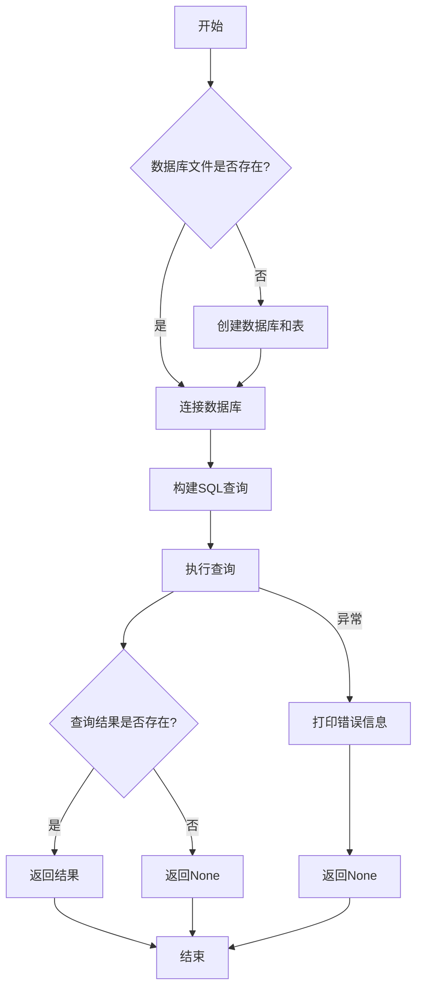

## 用途说明

check_account 函数用于从 SQLite 数据库中检索特定项目的账号或密码信息。该函数连接到指定的数据库文件，查询 connect_account_password 表中与给定项目名称匹配的记录，并返回指定的列（用户名或密码）。

## 参数

* column_name (str): 指定要检索的列名，通常为'username'或'password'
* project_name (str): 指定要检索的项目名称
## 返回值

* 如果找到匹配的记录，返回指定列的值
* 如果没有找到匹配的记录，返回 None
* 如果发生异常，返回 None 并打印错误信息
## 用法

函数调用示例及返回值说明：

```python
# 检索项目"example_project"的用户名
username = check_account('username', 'example_project')
print(f"用户名: {username}")

# 检索项目"example_project"的密码
password = check_account('password', 'example_project')
print(f"密码: {password}")
```

## 工作流程



## 示例代码

```python
# 示例1: 检索项目"TEST_PROJECT"的用户名
username = check_account('username', 'TEST_PROJECT')
print(f"用户名: {username}")

# 示例2: 检索项目"TEST_PROJECT"的密码
password = check_account('password', 'TEST_PROJECT')
print(f"密码: {password}")

# 示例3: 检索不存在的项目
result = check_account('username', 'NON_EXISTENT_PROJECT')
print(f"结果: {result}")  # 输出: 结果: None
```

## 注意事项

1. 函数默认连接到 D:\data\database\mm.db 数据库文件
1. 如果数据库文件不存在，函数会自动创建数据库和必要的表结构
1. 函数使用参数化查询防止 SQL 注入攻击
1. 函数会自动关闭数据库连接，无需手动管理资源
## 相关函数

* create_account_database(db_path): 创建账号密码数据库及表
* add_account(project_name, username, password): 向数据库添加账号密码
## 代码

```python
# 问题: 如何修改check_account函数以支持自定义数据库路径?
# 解决方案: 添加一个可选参数db_path，默认值为"D:\data\database\mm.db"
def check_account(column_name, project_name, db_path=r"D:\data\database\mm.db"):
    try:
        # 如果数据库不存在，先创建数据库
        if not os.path.exists(db_path):
            create_account_database(db_path)
            
        conn = sqlite3.connect(db_path)
        cursor = conn.cursor()

        # 使用 column_name 参数构建查询语句
        query = f"""
        SELECT {column_name}
        FROM connect_account_password
        WHERE project_name = ?
        """

        cursor.execute(query, (project_name,))
        result = cursor.fetchone()

        cursor.close()
        conn.close()

        if result:
            return result[0]  # 返回查询结果而不是列表
        else:
            return None

    except Exception as e:
        print(f"数据库操作错误：{e}")
        return None 
```

