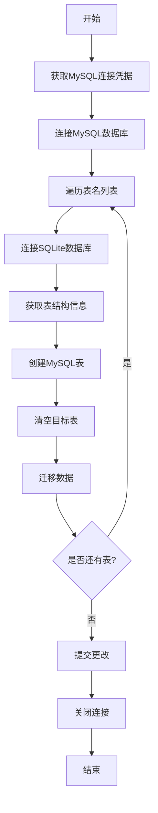

## 用途说明

该函数用于将 SQLite 数据库中的表数据迁移到 MySQL 数据库中。它支持多表迁移，自动创建表结构，并在迁移前清空目标表数据。

## 参数解释

* sqlite_db_path (str): SQLite 数据库文件的路径
* table_names (list): 需要迁移的表名列表
* host (str, 可选): MySQL 数据库主机地址，默认为'111.229.252.56'
## 功能特点

1. 自动从本地数据库获取 MySQL 连接凭据
1. 自动创建目标表结构
1. 迁移前自动清空目标表
1. 支持批量表迁移
1. 错误处理机制，单个表迁移失败不影响其他表
## 使用方法

```python
# 示例：迁移单个表
copy_table_to_mysql(
    sqlite_db_path=r"D:\data\database\mm.db",
    table_names=["mm"],
    host="111.229.252.55"
)

# 示例：迁移多个表
copy_table_to_mysql(
    sqlite_db_path=r"D:\data\database\mm.db",
    table_names=["table1", "table2", "table3"],
    host="111.229.252.56"
)
```

## 工作流程



## 注意事项

1. 确保 SQLite 数据库文件路径正确
1. 确保 MySQL 服务器可访问
1. 确保数据库账号具有足够的权限
1. 大量数据迁移时注意网络连接稳定性
## 错误处理

* 单个表迁移失败不会影响其他表的迁移
* 所有错误会被捕获并打印错误信息
* 数据库连接失败会立即终止操作
## 代码示例

```python
# 完整代码示例
import sqlite3
import pymysql

def copy_table_to_mysql(sqlite_db_path: str, table_names: list, host: str = '111.229.252.56'):
    # 获取连接凭据
    user = check_account('username', host)
    password = check_account('password', host)
    
    # 连接MySQL
    mysql_conn = pymysql.connect(
        host=host,
        user=user,
        password=password,
        database='financial_data'
    )
    mysql_cursor = mysql_conn.cursor()
    
    # 遍历处理每个表
    for table_name in table_names:
        try:
            # 连接SQLite并获取数据
            sqlite_conn = sqlite3.connect(sqlite_db_path)
            sqlite_cursor = sqlite_conn.cursor()
            
            # 获取表结构
            sqlite_cursor.execute(f"PRAGMA table_info({table_name})")
            columns_info = sqlite_cursor.fetchall()
            
            # 创建表并迁移数据
            # ... (具体实现代码)
            
        except Exception as e:
            print(f"复制{table_name}到MySQL时出错：{str(e)}")
            continue
    
    # 提交更改并关闭连接
    mysql_conn.commit()
    mysql_conn.close()
```

## 问题与解答

```python
# 常见问题解答
Q: 如何处理大量数据迁移时的性能问题？
A: 建议分批处理数据，可以使用游标分批读取和插入数据。

Q: 迁移失败时如何恢复？
A: 函数会在每个表迁移失败时打印错误信息，可以根据错误信息进行针对性处理。

Q: 如何确保数据一致性？
A: 函数会在迁移前清空目标表，并在所有操作完成后统一提交事务。
```

