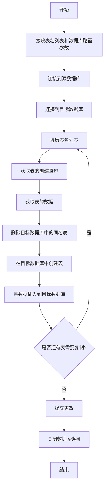

## 用途说明

copy_tables 函数用于将一个 SQLite 数据库中的多个数据表复制到另一个 SQLite 数据库中。该函数会复制表的结构和数据，如果目标数据库中已存在同名表，会先删除再创建。

## 参数

* table_names (list): 需要复制的表名列表
* source_db_path (str, 可选): 源数据库的路径，默认为'D:\wenjian\python\smart\data\guojin_account.db'
* target_db_path (str, 可选): 目标数据库的路径，默认为'D:\wenjian\synkdy\data\sync_database.db'
## 返回值

该函数不返回任何值，但会在目标数据库中创建表并复制数据。

## 使用方法

```python
# 导入函数
from cs import copy_tables

# 定义要复制的表名列表
table_names = ["account_info", "account_info_sbb"]

# 调用函数复制表
copy_tables(table_names)

# 也可以指定源数据库和目标数据库的路径
copy_tables(
    table_names, 
    source_db_path='D:\\wenjian\\python\\smart\\data\\guojin_account.db', 
    target_db_path=r"D:\wenjian\\synkdy\\data\\sync_database.db"
)
```

## 代码

```python
def copy_tables(table_names, source_db_path='D:\\wenjian\\python\\smart\\data\\guojin_account.db', target_db_path=r"D:\wenjian\\synkdy\\data\sync_database.db"):
    # 连接到源数据库
    conn1 = sqlite3.connect(source_db_path)
    cursor1 = conn1.cursor()

    # 连接到目标数据库
    conn2 = sqlite3.connect(target_db_path)
    cursor2 = conn2.cursor()

    for table_name in table_names:
        # 获取表的创建语句
        cursor1.execute(f"SELECT sql FROM sqlite_master WHERE type='table' AND name='{table_name}'")
        create_table_query = cursor1.fetchone()[0]

        # 获取表的数据
        cursor1.execute(f"SELECT * FROM {table_name}")
        data = cursor1.fetchall()

        # 如果目标数据库中已经存在同名表，先删除它
        cursor2.execute(f"DROP TABLE IF EXISTS {table_name}")

        # 在目标数据库中创建表
        cursor2.execute(create_table_query)

        # 将数据插入到目标数据库中
        for row in data:
            cursor2.execute(f"INSERT INTO {table_name} VALUES (" + ",".join(["?"]*len(row)) + ")", row)

    # 提交更改并关闭连接
    conn2.commit()
    conn1.close()
    conn2.close()
```

## 工作流程图



## 注意事项

1. 确保源数据库和目标数据库的路径正确且可访问
1. 确保有足够的权限读写这些数据库文件
1. 如果目标数据库中已存在同名表，该函数会先删除再创建，请确保不会丢失重要数据
1. 该函数仅支持 SQLite 数据库，不支持其他类型的数据库
