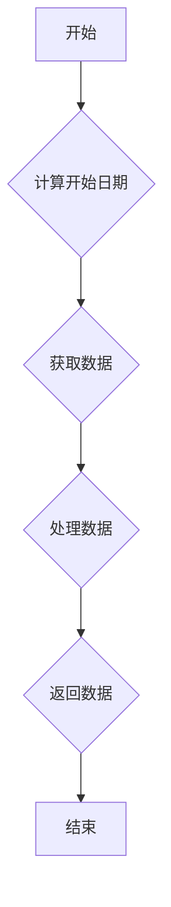

## 用途说明

该函数用于获取指定证券的7年K线历史数据，并以 Pandas DataFrame 格式返回。

## 参数

* stock_code (str): 证券代码，例如 '000001.SZ'。
* days (int, 可选): 获取历史数据的天数，默认为7年（7 * 365）。
## 返回值

* data_transposed (pandas.DataFrame): 包含历史K线数据的 DataFrame，字段包括：
* time: 日期，格式为 'YYYY-MM-DD'。
* open: 开盘价。
* close: 收盘价。
* high: 最高价。
* low: 最低价。
* volume: 成交量。
* amount: 成交额。
* settelementPrice:  结算价。
* openInterest:  持仓量。
* preClose:  前收盘价。
* suspendFlag:  停牌标志。
## 用法

调用 qmt_data_source(stock_code, days) 获取历史数据，例如：

```python
data = qmt_data_source('000001.SZ')
print(data.head())
```

## 示例

```python
import datetime
import pandas as pd
import xtdata

def qmt_data_source(stock_code, days=7*365):
    """
    获取指定证券的7年K线历史数据。

    Args:
        stock_code (str): 证券代码，例如 '000001.SZ'。
        days (int, 可选): 获取历史数据的天数，默认为7年（7 * 365）。

    Returns:
        pandas.DataFrame: 包含历史K线数据的 DataFrame。
    """

    # 计算7年前的日期
    start_time = (datetime.datetime.now() - datetime.timedelta(days=days)).strftime("%Y%m%d")

    field_list = ['time', 'open', 'close', 'high', 'low', 'volume', 'amount', 'settelementPrice', 'openInterest', 'preClose', 'suspendFlag']
    
    # 从新的数据源获取数据
    data = xtdata.get_market_data(field_list, [stock_code], period='1d', start_time=start_time, count=-1, dividend_type='front', fill_data=True)
    
    # 转置每个字段并连接在一起
    data_transposed = pd.concat([data[field].T for field in field_list], axis=1)
    data_transposed.columns = field_list
    data_transposed.reset_index(drop=True, inplace=True) # 重置索引
    
    # 将时间戳转换为日期字符串
    data_transposed['time'] = pd.to_datetime(data_transposed['time'], unit='ms') + pd.Timedelta(hours=8) # 加上时区偏移
    data_transposed['time'] = data_transposed['time'].dt.strftime('%Y-%m-%d')
    
    return data_transposed
```

## 函数流程图



## 代码

```python
# 通过qmt获取证券的7年K线历史数据，不包数据下载补充
def qmt_data_source(stock_code, days=7*365):

    # 计算7年前的日期
    start_time = (datetime.datetime.now() - datetime.timedelta(days=days)).strftime("%Y%m%d")
    # xtdata.download_history_data2([stock_code], period='1d', start_time=start_time, callback=on_progress)

    field_list = ['time', 'open', 'close', 'high', 'low', 'volume', 'amount', 'settelementPrice', 'openInterest', 'preClose', 'suspendFlag']
    
    # 从新的数据源获取数据
    data = xtdata.get_market_data(field_list, [stock_code], period='1d', start_time=start_time, count=-1, dividend_type='front', fill_data=True)
    
    # 转置每个字段并连接在一起
    data_transposed = pd.concat([data[field].T for field in field_list], axis=1)
    data_transposed.columns = field_list
    data_transposed.reset_index(drop=True, inplace=True) # 重置索引
    
    # 将时间戳转换为日期字符串
    data_transposed['time'] = pd.to_datetime(data_transposed['time'], unit='ms') + pd.Timedelta(hours=8) # 加上时区偏移
    data_transposed['time'] = data_transposed['time'].dt.strftime('%Y-%m-%d')
    
    return data_transposed
```

