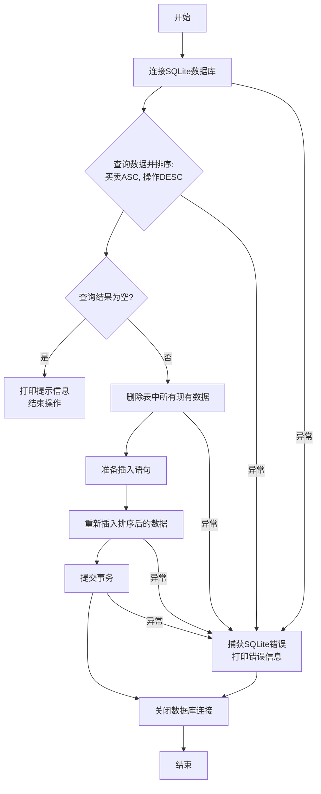

## 用途说明

对委托数据表进行排序并更新，按照先卖后买、先评分高后评分低的优先级重新组织数据。

## 参数

* table_name (str): 需要排序更新的表名称
* db_path (str): SQLite数据库文件路径，默认值为 r"D:/wenjian/python/smart/data/guojin_account.db"
## 使用方法

直接调用函数并传入表名和可选的数据库路径参数即可。函数会连接数据库，按指定规则对表中数据排序后重新写入。

## 示例代码

```python
# 使用默认数据库路径排序更新"委托数据"表
sort_and_update_table('委托数据')

# 指定自定义数据库路径
sort_and_update_table('委托数据', r"D:\path\to\your\database.db")
```

## 工作流程



## 代码

```python
def sort_and_update_table(table_name, db_path=r"D:/wenjian/python/smart/data/guojin_account.db"):
    conn = None
    try:
        # 连接到SQLite数据库
        conn = sqlite3.connect(db_path)
        cursor = conn.cursor()

        # 按照买卖和操作列排序查询数据
        cursor.execute(f"SELECT * FROM {table_name} ORDER BY 买卖 ASC, 操作 DESC")
        sorted_rows = cursor.fetchall()

        # 如果查询结果为空，则不进行后续操作
        if not sorted_rows:
            print("没有数据进行排序和更新。")
            return

        # 如果查询结果不为空，则删除所有现有数据
        cursor.execute(f"DELETE FROM {table_name}")

        # 为排序后的数据准备插入语句
        columns_count = len(sorted_rows[0])
        placeholders = ', '.join('?' * columns_count)
        insert_query = f"INSERT INTO {table_name} VALUES ({placeholders})"

        # 将排序后的数据重新插入到表中
        cursor.executemany(insert_query, sorted_rows)

        # 提交事务
        conn.commit()

    except sqlite3.Error as error:
        print("SQLite数据库错误:", error)

    finally:
        # 确保关闭数据库连接
        if conn:
            conn.close()
```

