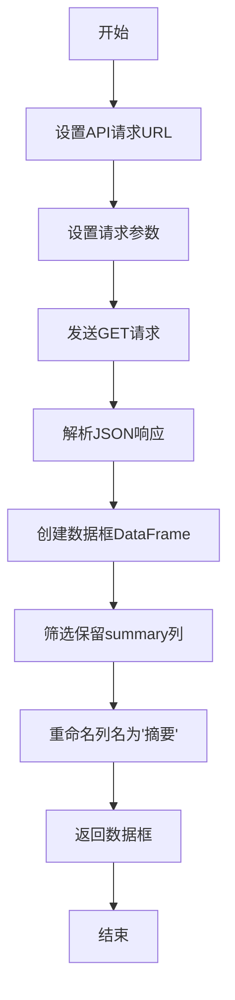

## 用途说明

该函数用于从东方财富网站获取全球财经快讯信息，默认获取最新的200条快讯，并只保留摘要信息，返回格式化的数据表。

## 参数

该函数不需要输入参数。

## 返回值

* 返回类型: pandas.DataFrame
* 返回内容: 包含"摘要"列的数据表，每行代表一条财经快讯的摘要信息
## 用法

直接调用函数即可获取财经快讯数据：

```python
df = stock_info_global_em()
```

## 示例

```python
import pandas as pd
from 测试16 import stock_info_global_em

# 获取东方财富全球财经快讯
news_df = stock_info_global_em()

# 显示获取的数据
print(news_df.head())

# 保存到CSV文件
news_df.to_csv("global_financial_news.csv", encoding="utf-8-sig", index=False)
```

## 工作流程图



## 函数源代码

```python
def stock_info_global_em() -> pd.DataFrame:
    """
    东方财富-全球财经快讯
    https://kuaixun.eastmoney.com/7_24.html
    :return: 全球财经快讯摘要
    :rtype: pandas.DataFrame
    """
    url = "https://np-weblist.eastmoney.com/comm/web/getFastNewsList"
    params = {
        "client": "web",
        "biz": "web_724",
        "fastColumn": "102",
        "sortEnd": "",
        "pageSize": "200",
        "req_trace": "1710315450384",
    }
    r = requests.get(url, params=params)
    data_json = r.json()
    temp_df = pd.DataFrame(data_json["data"]["fastNewsList"])
    temp_df = temp_df[["summary"]]
    temp_df.rename(
        columns={
            "summary": "摘要",
        },
        inplace=True,
    )
    return temp_df
```

