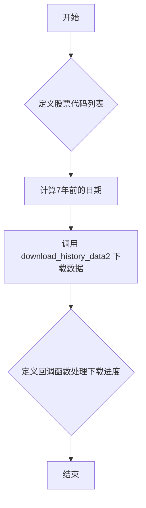

## 用途说明

该函数用于从国金QMT中下载指定股票代码的近7年历史行情数据。

## 参数

* stock_list (list): 股票代码列表，例如：['000001.SZ', '600000.SH']
## 用法

调用 download_7_years_data(stock_list)  以下载指定股票代码的近7年历史数据。

## 示例

```python
import yuhanbolh as lh
stock_list = ['000001.SZ', '600000.SH']
lh.download_7_years_data(stock_list)
```

## 流程图



## 代码

```python
# 从国金qmt中获取指定代码的近7年行情数据
def download_7_years_data(stock_list):
    # 计算7年前的日期
    start_time = (datetime.datetime.now() - datetime.timedelta(days=7*365)).strftime("%Y%m%d")

    # 下载近7年的历史数据
    xtdata.download_history_data2(stock_list, period='1d', start_time=start_time, callback=on_progress)
```

