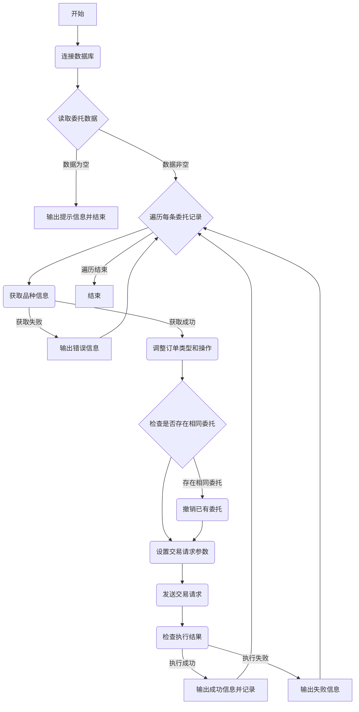

### 用途说明

该函数 execute_order_from_db 用于从指定的 SQLite 数据库表中读取交易委托信息，并通过 MetaTrader 5 (MT5) 平台执行这些交易委托。它适用于需要从外部数据库批量执行交易策略的场景。

### 参数

* db_path (str): SQLite 数据库文件的完整路径。
* table_name (str): 数据库中存储交易委托信息的表的名称。
### 工作流程



### 代码

```python
import sqlite3
import pandas as pd
import MetaTrader5 as mt5

def execute_order_from_db(db_path, table_name):
    """
    从数据库读取交易委托信息并执行。

    Args:
        db_path (str): SQLite 数据库文件的完整路径。
        table_name (str): 数据库中存储交易委托信息的表的名称。
    """
    try:
        # 连接到SQLite数据库
        conn = sqlite3.connect(db_path)
    
        # 读取数据库中的订单数据
        df = pd.read_sql(f"SELECT * FROM {table_name}", conn)
    except Exception as e:
        print(f"数据库读取错误: {e}")
        return
    finally:
        # 确保在任何情况下都关闭数据库连接
        conn.close()

    # 检查数据框是否为空
    if df.empty:
        print("委托数据表为空")
        return

    # 遍历DataFrame中的每一行
    for index, order_info in df.iterrows():
        try:
            symbol = order_info['品种名称']
            order_type = int(order_info['订单类型'])
            requested_price = float(order_info['价格'])

            # 获取当前市场价格
            symbol_info = mt5.symbol_info(symbol)
            if symbol_info is None:
                print(f"无法获取品种信息：{symbol}")
                continue

            current_price = symbol_info.bid if order_type in [0, 2] else symbol_info.ask

            # 调整订单类型和行动
            if order_type == 2 and requested_price > current_price:
                action = 1  # 市价委托
                order_type = 0  # 市价买单
            elif order_type == 3 and requested_price < current_price:
                action = 1  # 市价委托
                order_type = 1  # 市价卖单
            else:
                # action = 5  # 限价委托
                action = order_info['交易类型']  # 假设你已经在订单信息中存储了原始的动作
                order_type = order_info['订单类型']  # 保持原始的订单类型

            # 检查是否已有相同的委托单
            existing_orders = mt5.orders_get(symbol=symbol, magic=int(order_info['EA_id']), type=order_type)
            if existing_orders:
                for order in existing_orders:
                    # 撤销已有的委托单
                    request_cancel = {
                        "action": mt5.TRADE_ACTION_REMOVE,   # 相当于8
                        "order": order.ticket
                    }
                    mt5.order_send(request_cancel)

            # 设置交易请求字典
            request = {
                "action": action,
                "magic": int(order_info['EA_id']),
                "order": int(order_info['订单号']),
                "symbol": symbol,
                "volume": float(order_info['交易量']),
                "price": requested_price if action == 5 else current_price,
                "stoplimit": float(order_info['Limit挂单']),

                "sl": float(order_info['止损']),
                "tp": float(order_info['止盈']),

                "deviation": int(order_info['价格偏差']),
                "type": order_type,
                "type_filling": int(order_info['成交类型']),
                "type_time": int(order_info['订单有效期']),  # 设置订单的有效期
                "expiration": int(order_info['订单到期']),    # 订单到期 
                "comment": order_info['订单注释'],
                "position": int(order_info['持仓单号']),  # 持仓单号
                "position_by": int(order_info['反向持仓单号'])    # 反向持仓单号
            }

            print("交易请求：", request)
            # 发送交易请求
            result = mt5.order_send(request)


            # 检查执行结果，并输出相关信息
            if result is not None and result.retcode == mt5.TRADE_RETCODE_DONE:
                print("Order executed successfully:", result)
                # insert_into_db(db_path, result) # 假设你已经定义了这个函数
            else:
                print("Order execution failed:", result)
        except Exception as e:
            print(f"处理订单时出错: {e}")
```

