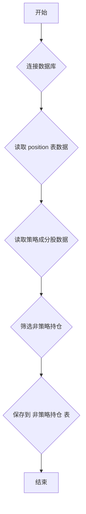

## 用途说明

该函数用于从数据库中筛选出所有不在指定策略成分股中的持仓，即已经被剔除的持仓，并将其保存到新的数据库表中。该函数每月运行一次。

## 参数

* db_path (str): 数据库文件的路径。
* tables (list): 包含策略成分股信息的数据库表名列表。
* magic_values (list): 策略magic值（即策略值）列表，用于筛选出特定策略的持仓。
## 用法

调用 export_non_strategy_positions(db_path, tables, magic_values) 函数，将会执行以下操作：

1. 连接到指定的数据库。
1. 读取position表中所有magic值在magic_values列表中的记录。
1. 读取tables列表中所有表的mt5代码列数据，并合并成一个集合。
1. 找出position表中不在tables列表中任何表mt5代码列出现的symbol数据。
1. 查询position表中symbol在步骤4结果集中的所有记录。
1. 将查询结果保存到非策略持仓表中，如果该表已存在则替换原有数据。
## 示例

```python
import yuhanbolh as lh
db_path = 'my_database.db'
tables = ['strategy_a', 'strategy_b']
magic_values = [12345, 67890]

lh.export_non_strategy_positions(db_path, tables, magic_values)
```

## 流程图



## 代码

```python
# 处理并保存“非策略持仓”，筛选出不是所有策略的持仓，即不在策略的成分股中，已经被剔除，每月运行一次。参数：数据库路径，策略表名，策略magic值（即策略值）
def export_non_strategy_positions(db_path, tables, magic_values):
    # 连接到数据库
    with sqlite3.connect(db_path) as conn:
        # 读取`position`表中符合`magic`值的所有行
        query = f"SELECT * FROM position WHERE magic IN ({','.join('?'*len(magic_values))})"
        df_position = pd.read_sql_query(query, conn, params=magic_values)
        symbols_from_position = set(df_position['symbol'])

        # 读取多个表的`mt5代码`列数据并合并
        symbols_from_other_tables = set()
        for table in tables:
            try:
                df = pd.read_sql_query(f"SELECT `mt5代码` FROM {table}", conn)
                symbols_from_other_tables.update(df['mt5代码'])
            except sqlite3.Error as e:
                print(f"Error reading from {table}: {e}")

        # 找出不在指定表`mt5代码`列中的`symbol`数据
        symbols_not_in_others = symbols_from_position - symbols_from_other_tables

        # 首先清空 '非策略持仓' 表中的内容，但保留表结构
        conn.execute('DELETE FROM 非策略持仓')

        # 如果有不在其他表中的symbols，则查询对应的完整行数据
        if symbols_not_in_others:
            params = tuple(symbols_not_in_others)
            query = f"SELECT * FROM position WHERE symbol IN ({','.join('?'*len(params))})"
            df_not_in_others = pd.read_sql_query(query, conn, params=params)

            # 将结果导出到新表“非策略持仓”中
            df_not_in_others.to_sql('非策略持仓', conn, if_exists='replace', index=False)

            # 使用Pandas打印表格形式的结果
            # print(df_not_in_others)
```

