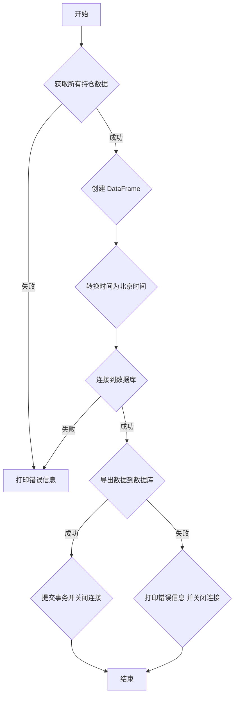

### 用途说明

该函数 export_positions_to_db 用于从 MetaTrader 5 (MT5) 平台获取当前所有持仓数据，并将其导出到指定的 SQLite 数据库和数据表中。

### 参数

* db_path (str): SQLite 数据库文件的完整路径。
* table_name (str): 用于存储持仓数据的数据库表名。
### 工作流程



### 用法

通过调用 export_positions_to_db(db_path, table_name) 函数，将 MT5 中的持仓数据导出到指定的数据库。

### 示例

```python
import yuhanbolh as lh
# 设置数据库路径和表名
db_path = "C:/trading_data.db"
table_name = "mt5_positions"

# 调用函数导出持仓数据
lh.export_positions_to_db(db_path, table_name)
```

### 代码

```python
# 将持仓数据保存到数据库
def export_positions_to_db(db_path, table_name):
    try:
        # 尝试获取所有持仓数据
        positions = mt5.positions_get()
        if positions is None:
            print("没有持仓, error code =", mt5.last_error())
        else:
            # 创建持仓数据的DataFrame
            df_positions = pd.DataFrame(list(positions), columns=positions[0]._asdict().keys())
            
            # 创建时区信息，北京时间为 UTC+8
            tz_beijing = timezone(timedelta(hours=8))

            # 转换时间戳为北京时间并更新DataFrame
            df_positions['time'] = pd.to_datetime(df_positions['time'], unit='s').dt.tz_localize('UTC').dt.tz_convert(tz_beijing)

            # 连接到SQLite数据库
            conn = sqlite3.connect(db_path)
            
            # 导出数据到数据库
            df_positions.to_sql(table_name, conn, if_exists='replace', index=False)
            
            print(f"导出数据到数据表{table_name} =", len(positions))

            # 提交事务并关闭连接
            conn.commit()

    except Exception as e:
        print("发生错误:", e)

    finally:
        # 确保在任何情况下都关闭数据库连接
        conn.close()
```

