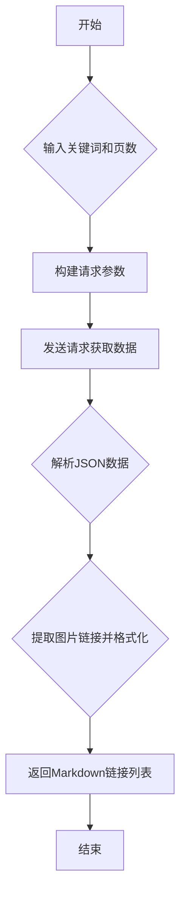

## 用途说明

爬取指定关键词在百度图片搜索结果中的图片链接，并将链接格式化为Markdown格式，方便用户直接复制使用。

## 参数

* keyword (str): 指定要搜索的图片关键词。
* pages (int, optional): 指定要爬取的页数，默认为1页，每页包含约10张图片。
## 用法

调用 fetch_baidu_image_links(keyword, pages)  以获取指定关键词和页数的图片链接列表，列表中的每个元素为格式化后的Markdown链接字符串。

## 示例

```python
image_links = fetch_baidu_image_links('风景', pages=2)
for link in image_links:
    print(link)
```

## 流程图



## 代码

```python
# 爬取百度图片搜索结果，并将图片链接格式化为Markdown，参数为搜索关键词和页数（每页10张图片）
def fetch_baidu_image_links(keyword, pages=1):
    header = {
        'User-Agent': 'Mozilla/5.0 (Macintosh; Intel Mac OS X 11_1_0) AppleWebKit/537.36 (KHTML, like Gecko) Chrome/87.0.4280.88 Safari/537.36'
    }

    # Initialize variables
    markdown_image_links = []
    pn = 1  # 'pn' indicates the starting image number for each page, typically 30 images are displayed at once

    for m in range(1, pages + 1):
        url = 'https://image.baidu.com/search/acjson?'
        param = {
            'tn': 'resultjson_com',
            'logid': '7517080705015306512',
            'ipn': 'rj',
            'ct': '201326592',
            'is': '',
            'fp': 'result',
            'queryWord': keyword,
            'cl': '2',
            'lm': '-1',
            'ie': 'utf-8',
            'oe': 'utf-8',
            'adpicid': '',
            'st': '',
            'z': '',
            'ic': '',
            'hd': '',
            'latest': '',
            'copyright': '',
            'word': keyword,
            's': '',
            'se': '',
            'tab': '',
            'width': '',
            'height': '',
            'face': '',
            'istype': '',
            'qc': '',
            'nc': '1',
            'fr': '',
            'expermode': '',
            'force': '',
            'cg': 'star',
            'pn': pn,
            'rn': '10',
            'gsm': '1e',
        }

        # Send request and get response
        response = requests.get(url=url, headers=header, params=param)
        response.encoding = 'utf-8'
        response = response.text
        # Convert string to JSON
        data_s = json.loads(response)
        a = data_s["data"]  # Extract data from 'data'

        # Format image URLs in Markdown and append to list
        for i, item in enumerate(a[:-1], start=1):  # Exclude the last empty data
            image_url = item.get("thumbURL", "not exist")  # Prevent KeyError
            if image_url != "not exist":
                markdown_link = f""
                markdown_image_links.append(markdown_link)

        pn += 9

    return markdown_image_links
```

