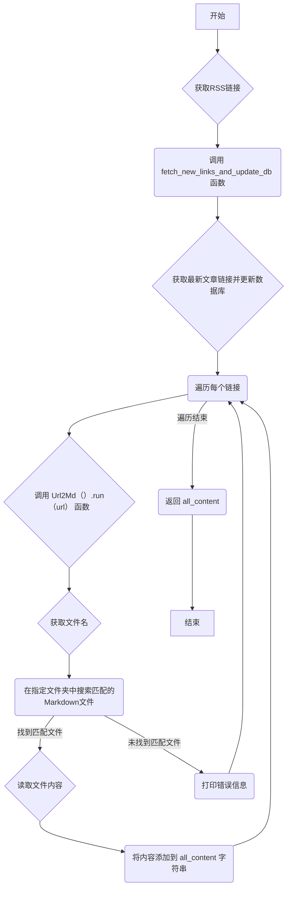

### 用途说明

该函数用于从本地 Markdown 文件中提取与指定 RSS 订阅链接相关的文章内容。它首先根据 RSS 链接获取最新的文章链接并更新本地数据库，然后在指定的文件夹中搜索与链接相关的 Markdown 文件，最后将所有找到的文件内容合并成一个字符串返回。

### 参数

* rss_url (str):  目标 RSS 订阅链接。
### 返回值

* all_content (str): 包含所有找到的 Markdown 文件内容的字符串。如果未找到匹配的文件，则返回空字符串。
### 用法

以下是如何使用该函数的示例：

```python
# 指定 RSS 订阅链接
rss_url = "https://example.com/feed.xml"

# 调用函数获取文章内容
all_content = fetch_content_from_md_files(rss_url)

# 打印提取的内容
print(all_content)
```

### 工作流程图



### 代码

```python
# 爬取微信公众号RSS订阅中的内容，并保存到本地，然后读取本地文件内容
def fetch_content_from_md_files(rss_url):
    # 固定的数据库路径和文件夹路径
    db_path = 'D:\\wenjian\\python\\smart\\data\\article.db'
    folder_path = 'D:\\wenjian\\obsidian\\笔记\\归纳检索\\RSS订阅'
    
    # 调用函数，传入RSS URL和数据库路径
    new_links = fetch_new_links_and_update_db(rss_url, db_path)
    
    um = Url2Md()
    all_content = ""  # 初始化一个空字符串，用于累积所有找到的文件内容
    for url in new_links:
        result = um.run(url)
        matched = False  # 标记是否找到匹配文件
        files = os.listdir(folder_path)
        for file in files:
            if file.endswith('.md') and result in file:
                # 构建完整的文件路径
                file_path = os.path.join(folder_path, file)
                # 打开并读取文件内容
                with open(file_path, 'r', encoding='utf-8') as file:
                    content = file.read()
                    all_content += content + "\n\n"  # 将文件内容累积到字符串中，并添加分隔
                    matched = True
                    break  # 找到匹配的文件后停止查找
        if not matched:
            print(f'No matching .md file found for result: {result}')
    return all_content.strip()  # 返回累积的内容字符串，移除尾部的空白字符

```

