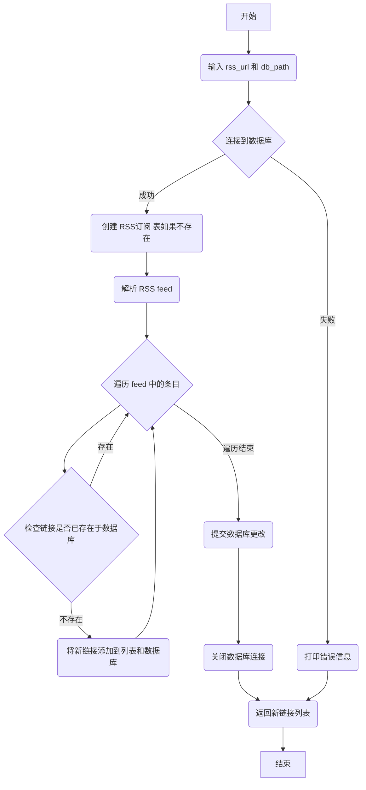

### 用途说明

此函数用于获取指定RSS订阅中的新链接，并将它们存储到SQLite数据库中。

### 参数

* rss_url (str): RSS订阅的URL地址。
* db_path (str): SQLite数据库文件的路径。
### 用法

调用 fetch_new_links_and_update_db(rss_url, db_path) 函数，传入RSS订阅的URL地址和数据库文件路径，即可获取新链接并更新数据库。函数将返回一个包含所有新链接的列表。

### 示例

```python
new_links = fetch_new_links_and_update_db('https://example.com/feed.rss', 'rss_data.db')

if new_links:
    print(f"发现 {len(new_links)} 个新链接:")
    for link in new_links:
        print(link)
else:
    print("未发现新链接。")
```

### 函数工作流程图



## 代码

```python
# 获取RSS订阅中的新链接并更新数据库
def fetch_new_links_and_update_db(rss_url, db_path):
    new_links = []  # 用于存储数据库中不存在的新链接

    try:
        # 连接到SQLite数据库
        conn = sqlite3.connect(db_path)
        cursor = conn.cursor()
        
        # 确保表存在
        cursor.execute('''CREATE TABLE IF NOT EXISTS RSS订阅
                          (链接 TEXT PRIMARY KEY)''')
        
        # 解析RSS feed
        feed = feedparser.parse(rss_url)
        
        # 检查新链接，同时更新数据库
        if feed.entries:
            for entry in feed.entries:
                link = entry.get('link', None)
                if link:
                    # 检查链接是否已存在于数据库中
                    cursor.execute('SELECT * FROM RSS订阅 WHERE 链接=?', (link,))
                    if cursor.fetchone() is None:
                        # 如果链接不存在，则添加到列表和数据库中
                        new_links.append(link)
                        cursor.execute('INSERT INTO RSS订阅 (链接) VALUES (?)', (link,))
        
        # 提交事务并关闭连接
        conn.commit()
        conn.close()
    except Exception as e:
        print(f"发生错误: {e}")
    
    return new_links
```

