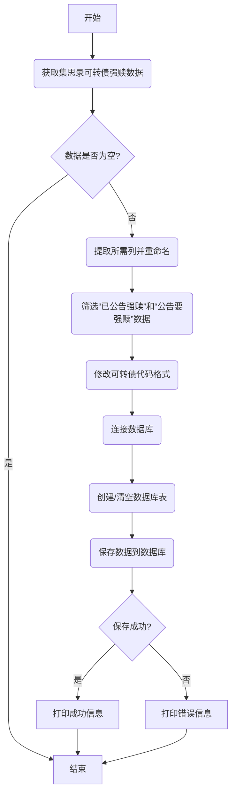

### 用途说明

该函数用于从集思录网站获取可转债强赎数据，筛选出包含“已公告强赎”和“公告要强赎”的数据，并将其保存到本地数据库。

### 参数

该函数没有参数。

### 用法

直接调用函数 filter_bond_cb_redeem_data_and_save_to_db() 即可执行数据获取、筛选和保存操作。

### 示例

```python
import yuhanbolh as lh

lh.filter_bond_cb_redeem_data_and_save_to_db()
```

### 工作流程图



### 代码解释

1. 获取数据: 使用 ak.bond_cb_redeem_jsl() 函数从集思录获取可转债强赎数据。
1. 筛选数据:
1. 数据预处理:
1. 数据库操作:
1. 异常处理: 使用 try...except...finally 语句块捕获可能出现的异常，并在出现异常时打印错误信息。
1. 关闭连接: 最后，无论是否出现异常都关闭数据库连接。
