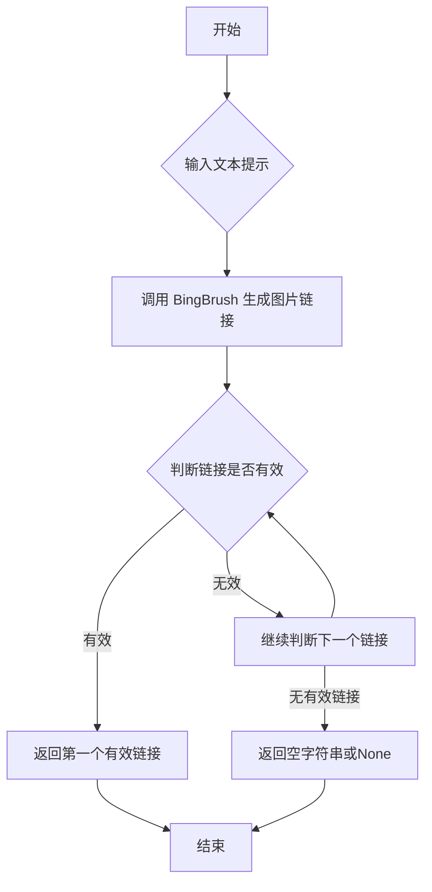

## 用途说明

本函数用于根据给定的文本提示，使用Bing Designer生成图片，并提取第一张图片的链接。

## 参数

* prompt (str): 用于生成图片的文本提示。
## 返回值

* str: 第一张图片的链接，如果未找到有效链接，则返回空字符串或None。
## 用法

调用 generate_first_image_links(prompt) 并传入文本提示，即可获取第一张生成图片的链接。

## 示例

```python
image_link = generate_first_image_links("美丽的日落")
if image_link:
    print(f"第一张图片的链接是：{image_link}")
else:
    print("未找到有效的图片链接")
```

## 函数工作流程图



## 代码

```python
# bing Designer文本生成图片，并提取第一张图的链接
def generate_first_image_links(prompt):
    try:
        brush = BingBrush(cookie='D:\\wenjian\\python\\data\\json\\bingbrush.json')  # cookie的路径
        image_urls = brush.process(prompt)
        # 返回第一个有效的图片链接
        for url in image_urls:
            # 跳过以.svg结尾的链接
            if url.endswith('.svg') or url.endswith('.js'):
                continue
            return url
        # 如果没有找到有效的链接，返回空字符串
        return ""
    except Exception as e:
        # 如果出现异常，打印异常信息（可选）并返回空字符串或None
        print(f"生成图片链接时出现错误: {e}")
        return None
```

