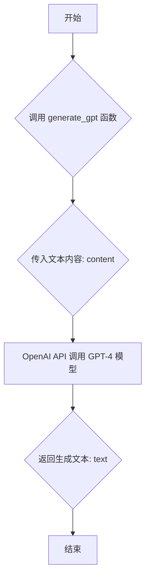

### 用途说明

generate_gpt 函数用于调用 OpenAI 的 GPT-4 模型，根据提供的文本内容生成新的文本。

### 参数

* content (str):  作为 GPT-4 模型输入的文本内容，用于引导模型生成相关文本。
### 返回值

* text (str): GPT-4 模型生成的文本内容。
### 用法

调用 generate_gpt(content) 并传入需要 GPT-4 模型处理的文本内容，函数将返回模型生成的文本。

### 示例

```python
input_content = "请帮我写一首关于春天的诗。"
generated_poem = generate_gpt(input_content)
print(f"生成的诗歌：\n{generated_poem}")
```

### 流程图



```python
def generate_gpt(content):
    # 替换为您的 OpenAI API 密钥
    client = OpenAI(
        api_key=check_account("password", "OPENAI_API_KEY"),
    )
    
    # 使用 ChatCompletion API 生成文本
    response = client.chat.completions.create(
        model="gpt-4-0125-preview",  # 根据实际可用模型来替换，这里假设模型是 gpt-4
        messages=[
            # {"role": "system", "content": "You are a helpful assistant."},
            {"role": "user", "content": content}
        ]
    )
    
    # 从响应中提取生成的文本
    text = response.choices[0].message.content  # 正确获取返回的消息内容
    return text
```

