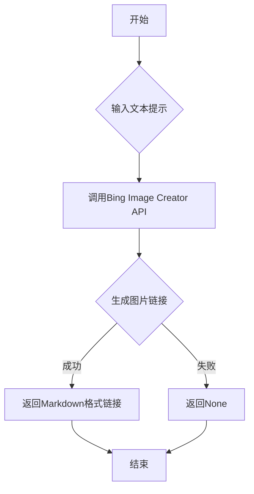

## 用途说明

使用Bing Image Creator API，根据给定的文本提示生成图片链接。

## 参数

* prompt (str): 描述所需图片的文本提示。
## 用法

调用 generate_image_links(prompt) ，函数将返回包含Markdown格式图片链接的字符串，如果出现错误，将返回None。

## 示例

```python
image_links = generate_image_links("日落时分，一只猫坐在屋顶上")
print(image_links)

# 预期输出：
# 
# 
# ...
```

## 流程图



## 代码

```python
# bing Designer文本生成图片
def generate_image_links(prompt):
    try:
        brush = BingBrush(cookie='D:\\wenjian\\python\\data\\json\\bingbrush.json')  # cookie的路径
        image_urls = brush.process(prompt)
        # 使用 Markdown 格式和字符串格式化来生成图片链接
        markdown_images = []
        for i, url in enumerate(image_urls, start=1):
            # 跳过以.svg结尾的链接
            if url.endswith('.svg') or url.endswith('.js'):
                continue
            markdown_images.append(f'')
        
        # 返回结果
        return "\n".join(markdown_images)
    except Exception as e:
        # 如果出现异常，打印异常信息（可选）并返回空字符串或None
        print(f"生成图片链接时出现错误: {e}")
        return None
```

