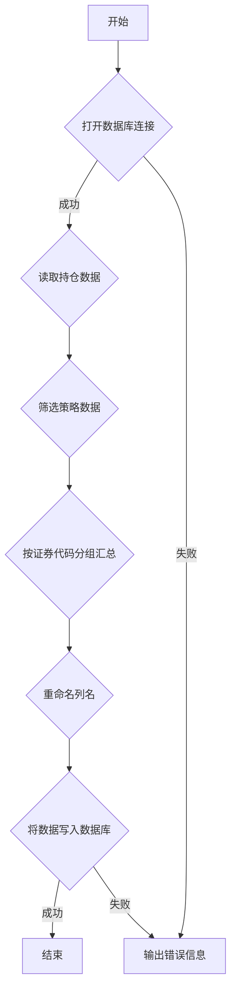

### 用途说明

该函数用于从交易数据库中提取指定打地鼠策略的持仓数据，并生成汇总表格。

### 参数

* db_path (str): 交易数据库文件的路径。
* strategies (list): 包含要提取持仓数据的策略名称列表。
### 工作流程图



### 用法

函数调用示例：

```python
import yuhanbolh as lh
lh.generate_mole_strategy('交易数据库.db', ['策略A', '策略B'])
```

该函数调用将从 交易数据库.db 中提取 策略A 和 策略B 的持仓数据，并生成汇总表格存储在数据库的 generate_mole_strategy 表中。

### 示例代码

```python
import sqlite3

def generate_mole_strategy(db_path, strategies):
    """
    从交易数据库中提取指定打地鼠策略的持仓数据，并生成汇总表格。

    Args:
        db_path (str): 交易数据库文件的路径。
        strategies (list): 包含要提取持仓数据的策略名称列表。
    """
    try:
        df = open_positions(db_path)[['策略名称', '委托类型', '证券代码', '成交均价', '成交数量', '成交金额', '买卖']]
        filtered_df = df[df['策略名称'].isin(strategies)]
        grouped_df = filtered_df.groupby('证券代码').agg({
            '策略名称': 'first',
            '委托类型': 'first',
            '成交均价': 'mean',
            '成交数量': 'sum',
            '成交金额': 'sum',
            '买卖': 'sum'
        }).reset_index()
        grouped_df = grouped_df.rename(columns={'成交数量': '持仓数量'})
        # 使用 with 语句管理数据库连接
        with sqlite3.connect(db_path) as conn:
            grouped_df.to_sql('generate_mole_strategy', conn, if_exists='replace', index=False)
    except Exception as e:
        print(f"An error occurred: {e}")

# 示例调用
generate_mole_strategy('交易数据库.db', ['策略A', '策略B'])
```

