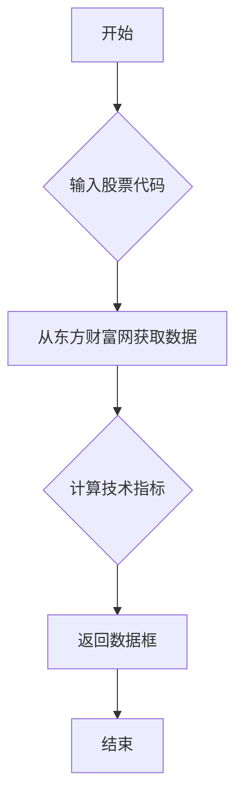

## 用途说明

该函数用于从东方财富网获取指定股票代码的8年历史数据，并计算各种技术指标。

## 参数

* stock_code (str): 6 位数+市场的股票代码，例如 '600519.SH'。
## 返回值

* pandas.DataFrame: 包含股票价格和各种技术指标的数据框，数据从第120个交易日开始。
## 技术指标列表

函数计算以下技术指标：

* MA: 简单移动平均线 (10, 20, 30, 50, 100, 200 天)
* EMA: 指数移动平均线 (10, 20, 30, 50, 100, 200 天)
* Ichimoku Cloud: 包含 Tenkan-sen, Kijun-sen, Senkou Span A, Senkou Span B, Chikou Span
* VWMA: 成交量加权平均线 (20 天)
* HullMA: Hull 移动平均线 (9 天)
* RSI: 相对强弱指数 (14 天)
* WPR: 威廉指标 (14 天)
* CCI: 商品通道指数 (20 天)
* ADX: 平均趋向指标 (14 天)
* StochRSI: 随机相对强弱指数 (14, 3, 3)
* AO:  动量震荡指标
* MTM: 动量指标
* MACD:  平滑异同移动平均线 (12, 26)
* BBP: 布林带百分比 (13 天)
* UO:  终极波动指标 (7, 14, 28)
* Linear Regression: 线性回归 (10, 20, 60, 120 天)
## 用法

以下是如何使用该函数的示例：

```python
import yuhanbolh as lh
stat_data = lh.generate_stat_data('600519.SH')
print(stat_data.head())
```

## 函数工作流程图



## 代码

```python
# 从东财获取8年数据，计算各种指标指标，参数为股票代码
def generate_stat_data(stock_code):
    data = json_to_dfcf(stock_code, days=365*8, fqt=1, klt=101)

    ma10 = MA(data, 10)
    ma20 = MA(data, 20)
    ma30 = MA(data, 30)
    ma50 = MA(data, 50)
    ma100 = MA(data, 100)
    ma200 = MA(data, 200)

    ema10 = EMA(data, 10)
    ema20 = EMA(data, 20)
    ema30 = EMA(data, 30)
    ema50 = EMA(data, 50)
    ema100 = EMA(data, 100)
    ema200 = EMA(data, 200)

    ic = ichimoku_cloud(data,9, 26, 52, 26)

    vwma = VWMA(data, 20)

    hm = HullMA(data, 9)

    rsi = RSI(data, 14)

    wpr = WPR(data, 14)

    cci = CCI(data, 20)

    adx = ADX(data, 14)

    stok = STOK(data, 14, 3, 3)

    ao = AO(data)

    mtm = MTM(data)

    madc_level = MACD_Level(data, 12, 26)

    stoch_rsi = Stoch_RSI(data, 3, 3, 14, 14)

    bbp = BBP(data, 13)

    uo = UO(data, 7, 14, 28)

    lr = linear_regression_dfcf(data, [10, 20, 60, 120])

    stat_data = pd.concat([data, ma10, ma20, ma30, ma50, ma100, ma200, ema10, ema20, ema30, ema50, ema100, ema200, ic, vwma, hm, rsi,  cci, adx, wpr, stok, ao, mtm, madc_level, stoch_rsi, bbp, uo, lr], axis=1) 

    # 获取从120个数据之后的数据，因为线性回归计算的最长的一个日期是120交易日
    stat_data_after_120 = stat_data.iloc[119:]
    return stat_data_after_120
```

