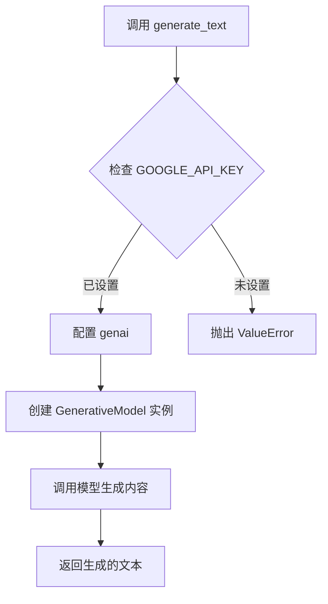

## 用途说明

调用 Google Gemini Pro 模型，根据输入的文本或代码生成相应的文本内容。

## 参数

* query (str):  输入的文本或代码，作为生成内容的依据。
## 用法

调用generate_text(query) 并传入需要处理的文本或代码，函数会返回模型生成的文本。

## 示例

```python
response_text = generate_text("写一首关于春天的诗")
print(response_text)
```

## 流程图



## 代码

```python
def generate_text(query):


    GOOGLE_API_KEY = check_account("password", "GOOGLE_API_KEY")

    # 确保API密钥已正确设置
    if GOOGLE_API_KEY is None:
        raise ValueError("请设置环境变量 GOOGLE_API_KEY 为您的API密钥。")

    # 使用API密钥配置SDK
    genai.configure(api_key=GOOGLE_API_KEY)

    # 选择一个模型并创建一个GenerativeModel实例
    model = genai.GenerativeModel('gemini-1.5-pro-latest')

    # 使用模型生成内容
    response = model.generate_content(query)

    # 返回生成的文本
    return response.text
```

