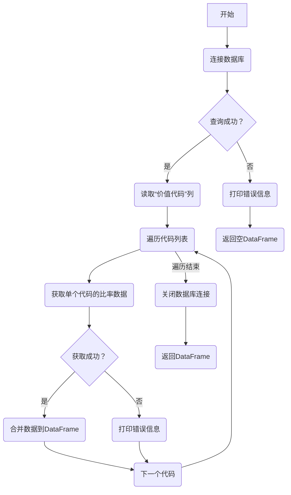

## 用途说明

该函数用于从数据库中读取一列“价值代码”，并使用这些代码批量获取对应的价值大师比率数据。

## 参数

* db_path (str): 数据库文件的路径。
* table_name (str): 包含“价值代码”列的数据库表名。
## 用法

调用 get_all_valuation_ratios_db(db_path, table_name)，传入数据库路径和表名，函数将返回一个包含所有价值大师比率数据的 DataFrame。

## 示例

```python
import yuhanbolh as lh
db_path = "valuation_data.db"
table_name = "stock_list"

all_ratios_df = lh.get_all_valuation_ratios_db(db_path, table_name)

print(all_ratios_df)
```

## 流程图



## 代码

```python
# 通过读取excel中的列“代码”，从而获取价值大师价格
def get_all_valuation_ratios_db(db_path, table_name):
    """
    从数据库表中读取“价值代码”，然后获取相应的价值大师价格。

    参数:
    db_path: str
        数据库文件的路径。
    table_name: str
        包含“价值代码”的数据库表名。

    返回:
    all_ratios: DataFrame
        包含所有价值大师比率数据的 DataFrame。
    """
    try:
        # 尝试连接到 SQLite 数据库
        conn = sqlite3.connect(db_path)
        
        # 尝试执行 SQL 查询以获取“价值代码”列，并将其转换为列表
        query = f"SELECT `价值代码` FROM `{table_name}`"
        codes = pd.read_sql_query(query, conn)['价值代码'].astype(str).tolist()
    except Exception as e:
        print(f"Database connection or query failed: {e}")
        return pd.DataFrame()  # 返回一个空的 DataFrame

    all_ratios = pd.DataFrame()  # 创建一个空的 pandas DataFrame 来保存所有的比率数据
    for code in codes:  # 遍历所有代码并获取比率数据
        try:
            ratios = get_valuation_ratios(code)  # 假设这是一个自定义函数，用于获取价值大师比率
            all_ratios = pd.concat([all_ratios, ratios])  # 将获取的数据拼接到 DataFrame
        except Exception as e:
            print(f"Error occurred for code {code}: {e}")
            continue  # 发生错误时继续处理下一个代码

    # 关闭数据库连接
    conn.close()
    return all_ratios
```

