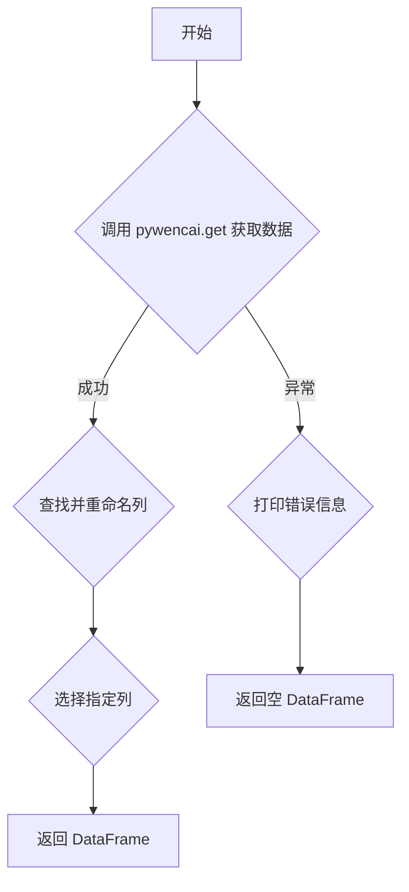

## 用途说明

该函数用于从问财平台爬取可转债数据，并对数据进行清洗和格式化，最终返回一个包含指定列的 Pandas DataFrame。

## 参数

* question (str):  发送给问财平台的查询语句。
## 返回值

* pandas.DataFrame: 包含清洗后的问财可转债数据的 DataFrame。如果出现错误，则返回一个空的 DataFrame。
## 用法

调用 get_clean_data(question) 并传入问财查询语句，即可获取清洗后的数据。

## 示例

```python
import pywencai
import pandas as pd
import numpy as np
import yuhanbolh as lh

# 定义查询语句
question = "满足强赎的可转债"

# 调用函数获取数据
data = lh.get_clean_data(question)

# 打印数据
print(data)
```

## 函数工作流程图



```python
def get_clean_data(question):
    try:
        data = pywencai.get(question=question, query_type='conbond', loop=True)
        
        # 查找列名中包含特定关键字的列并进行重命名
        col_names_to_change = ["可转债代码", "可转债简称", "涨跌幅", "最新价", "正股代码", "正股简称", "纯债价值", "期权价值", "最新变动后余额", "转股溢价率", "满足强赎", "强赎天计数"]
        for name in col_names_to_change:
            col_name = [col for col in data.columns if name in col]
            if col_name:
                # 重命名列名
                data.rename(columns={col_name[0]: name}, inplace=True)
            else:
                # 若未找到，则创建一个新的列，所有值都为空
                data[name] = np.nan
        
        # 只保留指定的列
        data = data[col_names_to_change]
        return data
    except Exception as e:
        print(f"获取清洗后的数据时出错: {e}")
        return pd.DataFrame()
```

