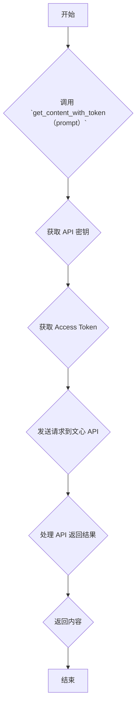

## 用途说明

该函数用于通过调用文心 API，根据提供的 prompt 获取相应的内容。

## 参数

* prompt (str):  发送给文心 API 的提示文本，用于生成内容。
## 用法

调用 get_content_with_token(prompt) 函数，传入提示文本 prompt，即可获取文心 API 返回的内容。

## 示例

```python
content = get_content_with_token("你好，请给我写一首关于春天的诗。")
print(f"文心 API 返回的内容：{content}")
```

## 函数工作流程图



## 代码

```python
# 从文心api获得内容
def get_content_with_token(prompt):
    api_key = check_account("password", "BAIDU_API_KEY")
    secret_key = check_account("password", "BAIDU_SECRET_KEY")
    def get_access_token():
        url = "https://aip.baidubce.com/oauth/2.0/token"
        params = {
            "grant_type": "client_credentials",
            "client_id": api_key,
            "client_secret": secret_key
        }
        try:
            response = requests.post(url, params=params)
            response.raise_for_status()  # 如果请求失败，会抛出一个异常
            return response.json().get("access_token")
        except requests.exceptions.RequestException as e:
            print(f"获取access token时发生错误: {e}")
            return None

    access_token = get_access_token()
    if not access_token:
        return "获取 access token 失败"

    # completions_pro是ERNIE-Bot 4.0，eb-instant是ERNIE-Bot-turbo
    url = f"https://aip.baidubce.com/rpc/2.0/ai_custom/v1/wenxinworkshop/chat/completions_pro?access_token={access_token}"
    payload = json.dumps({
        "messages": [
            {
                "role": "user",
                "content": prompt
            }
        ]
        # 可以添加其他参数
    })
    headers = {
        'Content-Type': 'application/json'
    }
    try:
        response = requests.post(url, headers=headers, data=payload)
        response.raise_for_status()  # 如果请求失败，会抛出一个异常
        response_data = response.json()
        content = response_data.get("result")  # 获取结果文本
        return content if content else "未能获取有效内容"
    except requests.exceptions.RequestException as e:
        return f"请求过程中发生错误: {e}"
```

