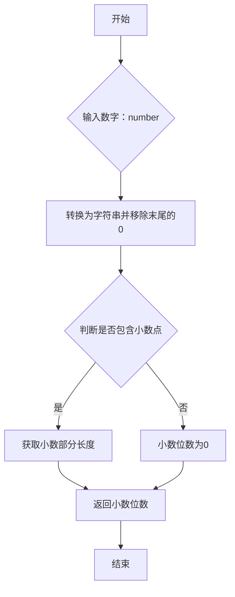

### 用途说明

该函数用于获取一个数字小数点后的位数。

### 参数

* number (int/float): 需要获取小数点后位数的数字。
### 返回值

* int:  number 小数点后的位数。如果 number 是整数，则返回0。
### 用法

调用 get_decimal_places(number) 并传入需要处理的数字。函数将返回该数字小数点后的位数。

### 示例

```python
import yuhanbolh as lh
# 示例1：浮点数
decimal_places = lh.get_decimal_places(3.14159)
print(f"3.14159的小数点后位数为：{decimal_places}")  # 输出：5

# 示例2：整数
decimal_places = lh.get_decimal_places(12345)
print(f"12345的小数点后位数为：{decimal_places}")  # 输出：0

# 示例3: 末尾带0的浮点数
decimal_places = lh.get_decimal_places(1.234000)
print(f"1.234000的小数点后位数为：{decimal_places}")  # 输出：3
```

### 流程图



