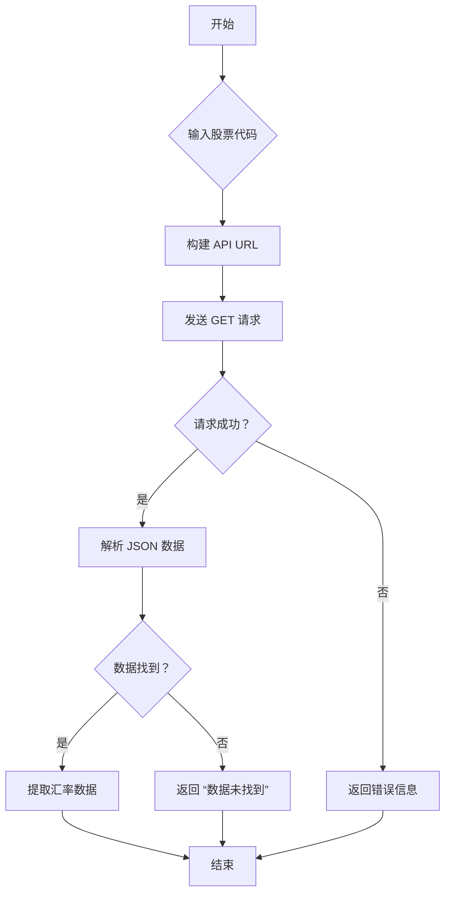

### 用途说明

get_exchange_rate 函数用于从东方财富网 API 获取指定股票代码的实时汇率信息，并提取汇率数据返回。

### 参数

* secid (str): 股票代码，格式为 "市场代码.股票代码"，例如 "133.USDCNH"。
### 返回值

* exchange_rate (float): 提取的汇率数据。如果请求失败或数据未找到，则返回相应的错误信息。
### 用法

调用 get_exchange_rate(secid) 函数，传入股票代码即可获取对应的汇率信息。

### 示例

```python
import yuhanbolh as lh

exchange_rate = lh.get_exchange_rate("133.USDCNH")
print(f"USDCNH 汇率：{exchange_rate}")

```

### 流程图



## 代码

```python
# 从东方财富网的API获取指定股票代码的汇率信息，并提取汇率数据，常用
def get_exchange_rate(secid):
    """
    从东方财富网的API获取指定股票代码的汇率信息，并提取汇率数据。

    参数:
    secid: str
        股票代码，格式为 "市场代码.股票代码"，例如 "133.USDCNH"。

    返回:
    exchange_rate: float
        提取的汇率数据。
    """
    # 构建 API URL
    api_url = f"http://push2his.eastmoney.com/api/qt/stock/kline/get?" \
              f"&secid={secid}&fields1=f1,f2,f3,f4,f5,f6,f7,f8" \
              f"&fields2=f50,f51,f52,f53,f54,f55,f56,f57,f58,f59,f60,f61" \
              f"&klt=101&fqt=0&end=20280314&lmt=1"

    try:
        # 发送 GET 请求到 API URL
        response = requests.get(api_url)

        # 检查请求是否成功
        if response.status_code == 200:
            # 解析响应的 JSON 数据
            data = response.json()
            # 导航至 JSON 数据以找到所需数据
            kline_data = data.get("data", {}).get("klines", [])
            if kline_data:
                # 从 kline 字符串中提取第二个值（汇率）
                exchange_rate = kline_data[0].split(',')[2]
                return float(exchange_rate)
            else:
                return "数据未找到"
        else:
            return "请求失败，状态码：" + str(response.status_code)
    except Exception as e:
        return "请求过程中发生异常：" + str(e)
```

