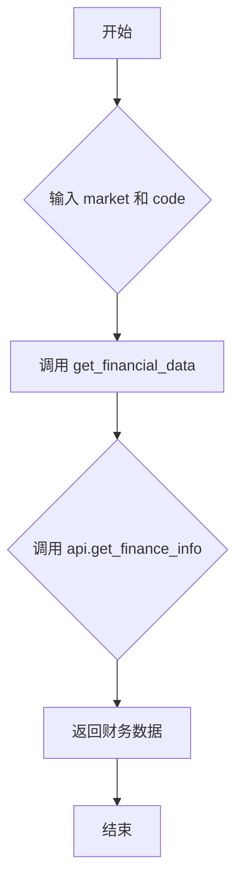

## 用途说明

该函数用于获取指定股票的财务数据。它通过调用 get_financial_data 函数，并使用提供的 global_tdx_ip 和 global_tdx_port 连接到通达信行情服务器获取数据。

## 参数

* market (int): 市场代码。0 表示深圳市场，1 表示上海市场。
* code (str): 股票代码。
## 返回值

函数返回 get_financial_data 的结果，该结果是调用 api.get_finance_info(market, code) 的返回值。具体返回值类型和内容取决于通达信 API 的实现。

## 用法

调用 get_finance_info(market, code)，传入市场代码和股票代码即可获取财务数据。

## 示例

```python
import yuhanbolh as lh

# 获取通达信的ip地址和端口号，从自己安装的通达信配置文件中读取
lh.init_global_address(r"D:\jiaoyi\gxtdx\connect.cfg")

financial_data = lh.get_finance_info(0, '000001')
print(financial_data)
```

## 流程图



## 代码

```python
def get_finance_info(market, code):
    """获取财务数据
    Args:
        market: 市场代码（0:深圳, 1:上海）
        code: 股票代码
    """
    return get_financial_data(global_tdx_ip, global_tdx_port, lambda api: api.get_finance_info(market, code))
```

