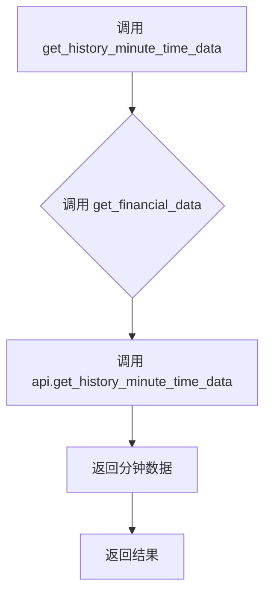

## 用途说明

该函数用于获取指定股票在特定日期的历史分钟级交易数据。它通过调用 get_financial_data 函数，并使用 api.get_history_minute_time_data 接口来实现数据获取。

## 参数

* market (int): 市场代码。0 表示深圳证券交易所，1 表示上海证券交易所。
* code (str): 股票代码。例如，"000001" 表示平安银行。
* date (int): 日期，格式为 YYYYMMDD，例如 20241115。
## 返回值

该函数返回 get_financial_data 函数的执行结果，该结果的具体内容取决于 api.get_history_minute_time_data 接口的返回值。通常情况下，返回值是一个包含分钟级交易数据的列表或字典。  如果发生错误，则可能返回错误信息或空值。

## 用法

通过传入市场代码、股票代码和日期，调用 get_history_minute_time_data 函数即可获取历史分钟数据。

## 示例

```python
import yuhanbolh as lh

# 获取通达信的ip地址和端口号，从自己安装的通达信配置文件中读取
lh.init_global_address(r"D:\jiaoyi\gxtdx\connect.cfg")

data = lh.get_history_minute_time_data(0, "000001", 20241115)
print(data)
```

## 流程图



## 原代码

```python
def get_history_minute_time_data(market, code, date):
    """获取历史分钟数据
    Args:
        market: 市场代码（0:深圳, 1:上海）
        code: 股票代码
        date: 日期，格式如20241115
    """
    return get_financial_data(global_tdx_ip, global_tdx_port, lambda api: api.get_history_minute_time_data(market, code, date))

```

