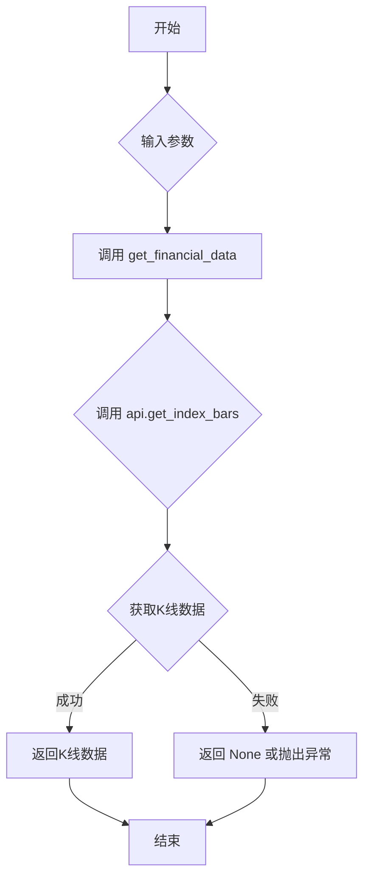

## 用途说明

该函数用于从通达信服务器获取指定指数的K线数据。

## 参数

* category (int): K线类型。
* market (int): 市场代码。
* code (str): 指数代码。
* start (int): 起始位置。0为最新数据，1为倒数第二条数据，以此类推。
* count (int): 获取的数据数量。
## 返回值

返回一个列表，包含指定数量的K线数据。列表的每个元素是一个字典，包含K线数据的各项指标（例如：开盘价、收盘价、最高价、最低价、成交量等）。  具体返回值格式取决于get_financial_data和api.get_index_bars的实现。 如果获取数据失败，则可能返回None或抛出异常。

## 用法

调用 get_index_bars(category, market, code, start, count)  获取指数K线数据。

## 示例

```python
import yuhanbolh as lh

# 获取通达信的ip地址和端口号，从自己安装的通达信配置文件中读取
lh.init_global_address(r"D:\jiaoyi\gxtdx\connect.cfg")

index_data = lh.get_index_bars(9, 1, '000001', 1, 2)  # 获取深圳市场上证指数的1分钟K线数据，最新的10条
print(index_data)

```

## 流程图



## 原代码

```python
def get_index_bars(category, market, code, start, count):
    """获取指数K线数据
    Args:
        category: K线类型（0:分时, 1:1分钟, 2:5分钟, 3:15分钟, 4:30分钟, 5:60分钟）
        market: 市场代码（0:深圳, 1:上海）
        code: 指数代码
        start: 起始位置（0为最新）
        count: 数量
    """
    return get_financial_data(global_tdx_ip, global_tdx_port, lambda api: api.get_index_bars(category, market, code, start, count))

```

