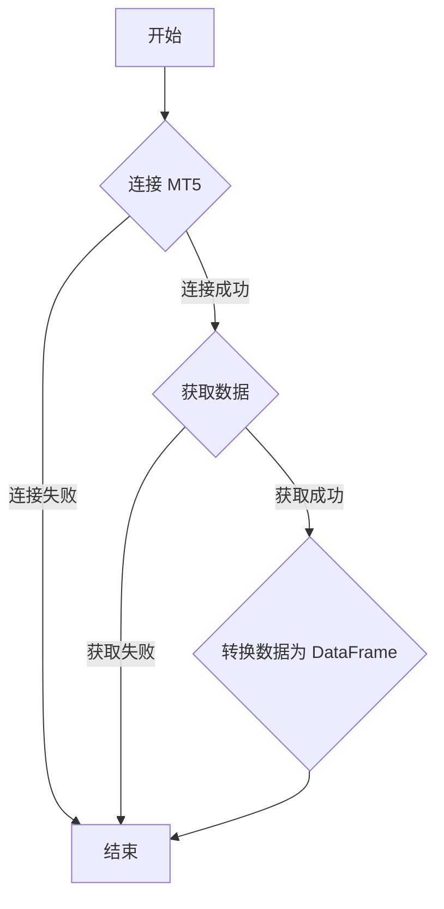

## 用途说明

该函数用于从 MetaTrader 5 (MT5) 平台获取指定品种的 8 年历史日线数据，并将数据整理为 Pandas DataFrame 格式返回。

## 参数

* symbol (str):  希望获取数据的市场品种的符号，例如 "EURUSD"，"GBPUSD" 等。
## 返回值

* df (DataFrame): 包含历史日线数据的 Pandas DataFrame，包含以下列：
## 用法

通过传入品种代码调用 get_mt5_data 函数，即可获取该品种的历史日线数据。

## 示例

```python
import MetaTrader5 as mt5
import pandas as pd
import yuhanbolh as lh

# 初始化 MT5 连接
mt5.initialize()

# 获取 EURUSD 的历史日线数据
eurusd_data = lh.get_mt5_data("EURUSD")

# 打印 DataFrame 的前 5 行
print(eurusd_data.head())

# 断开 MT5 连接
mt5.shutdown()
```

## 函数工作流程图



## 代码

```python
# 从MT5获取指定品种的8年历史日线数据
def get_mt5_data(symbol):
    """
    从MT5获取指定品种的历史日线数据，并返回包含所有数据的DataFrame。

    参数:
    symbol: str
        希望获取数据的市场品种的符号。
    
    返回:
    df: DataFrame
        包含历史日线数据的DataFrame。
    """
    try:
        # 设置时间范围
        timezone = mt5.TIMEFRAME_D1  # 日线数据
        current_time = datetime.now()
        one_year_ago = current_time - timedelta(days=365*8)
        
        # 获取品种从一年前到当前时间的日线数据
        rates = mt5.copy_rates_range(symbol, timezone, one_year_ago, current_time)
        
        # 如果成功获取到数据，进行数据转换
        if rates is not None and len(rates) > 0:
            # 将数据转换为Pandas DataFrame
            df = pd.DataFrame(rates)
            # 转换时间格式
            df['time'] = pd.to_datetime(df['time'], unit='s')
            # 重命名 'tick_volume' 列为 'volume'
            df.rename(columns={'tick_volume': 'volume'}, inplace=True)
        else:
            print(f"No rates data found for {symbol}")
            df = pd.DataFrame()  # 如果没有数据，则返回一个空的DataFrame
        return df
    except Exception as e:
        print(f"在获取数据时发生错误：{e}")
        return pd.DataFrame()  # 发生异常时返回一个空的DataFrame
```

