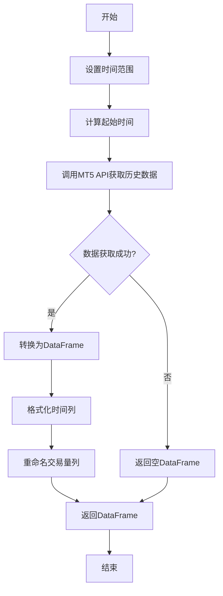

## 用途说明

从MetaTrader5交易平台获取指定交易品种的历史日线数据，并转换为pandas DataFrame格式便于后续分析。

## 参数

* symbol (str): 希望获取数据的市场品种的符号，如"EURUSD"。
* days (int): 希望获取的历史数据天数，默认为8年(365*8天)。
## 返回值

* df (DataFrame): 包含历史日线数据的pandas DataFrame，包含时间、开盘价、最高价、最低价、收盘价和交易量等信息。若获取失败，则返回空DataFrame。
## 使用方法

直接调用函数，传入交易品种符号和所需的历史数据天数。

## 示例代码

```python
import pandas as pd
from datetime import datetime
import MetaTrader5 as mt5

# 初始化MT5连接
if not mt5.initialize():
    print("初始化失败")
    quit()

# 获取欧元兑美元8年的历史日线数据
eurusd_data = get_mt5_data_with_days('EURUSD', 365*8)
print(eurusd_data.head())

# 获取黄金最近1年的历史日线数据
gold_data = get_mt5_data_with_days('XAUUSD', 365)
print(gold_data.shape)

# 关闭MT5连接
mt5.shutdown()
```

## 流程图



## 代码

```python
def get_mt5_data_with_days(symbol, days=365*8):
    """
    从MT5获取指定品种的历史日线数据，日期长度可自定义，并返回包含所有数据的DataFrame。

    参数:
    symbol: str
        希望获取数据的市场品种的符号。
    days: int
        希望获取的历史数据天数，默认为8年(365*8天)。
    
    返回:
    df: DataFrame
        包含历史日线数据的DataFrame。
    """
    try:
        # 设置时间范围
        timezone = mt5.TIMEFRAME_D1  # 日线数据
        current_time = datetime.now()
        start_time = current_time - timedelta(days=days)
        
        # 获取品种从指定天数前到当前时间的日线数据
        rates = mt5.copy_rates_range(symbol, timezone, start_time, current_time)
        
        # 如果成功获取到数据，进行数据转换
        if rates is not None and len(rates) > 0:
            # 将数据转换为Pandas DataFrame
            df = pd.DataFrame(rates)
            # 转换时间格式
            df['time'] = pd.to_datetime(df['time'], unit='s')
            # 重命名 'tick_volume' 列为 'volume'
            df.rename(columns={'tick_volume': 'volume'}, inplace=True)
        else:
            print(f"未找到 {symbol} 的数据")
            df = pd.DataFrame()  # 如果没有数据，则返回一个空的DataFrame
        return df
    except Exception as e:
        print(f"在获取数据时发生错误：{e}")
        return pd.DataFrame()  # 发生异常时返回一个空的DataFrame 
```

