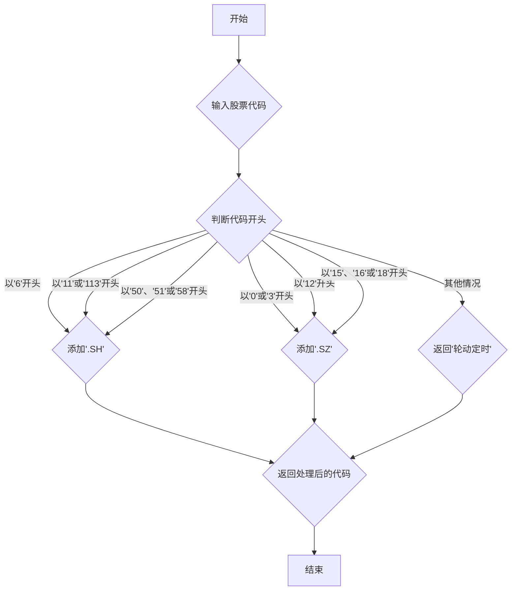

## 用途说明

该函数用于向股票代码添加市场信息，例如 'SH' 或 'SZ'，以便更清晰地标识股票所属市场。

## 参数

* stock_code (str/int): 原始的股票代码，可以是字符串或整数类型。
## 用法

调用 get_processed_code(stock_code) 函数，传入原始股票代码作为参数，即可获取添加了市场信息的股票代码。

## 示例

```python
import yuhanbolh as lh

stock_code = '600030'
processed_code = get_processed_code(stock_code)
print(f"处理后的股票代码：{processed_code}") 
# 输出：处理后的股票代码：600030.SH
```

## 流程图



```python
# 股票代码增加市场信息
def get_processed_code(stock_code):
    stock_code = str(stock_code)

    if stock_code.startswith('6'):  # 沪市股票
        market = 'SH'
    elif stock_code.startswith('0') or stock_code.startswith('3'):  # 深市股票
        market = 'SZ'
    elif stock_code.startswith('11') or stock_code.startswith('113'):  # 沪市可转债
        market = 'SH'
    elif stock_code.startswith('12'):  # 深市可转债
        market = 'SZ'
    elif stock_code.startswith('50') or stock_code.startswith('51') or stock_code.startswith('58'):  # 沪市场内基金
        market = 'SH'
    elif stock_code.startswith('15') or stock_code.startswith('16') or stock_code.startswith('18'):  # 深市场内基金
        market = 'SZ'
    else:
        return "轮动定时"

    return f"{stock_code}.{market}"
```

