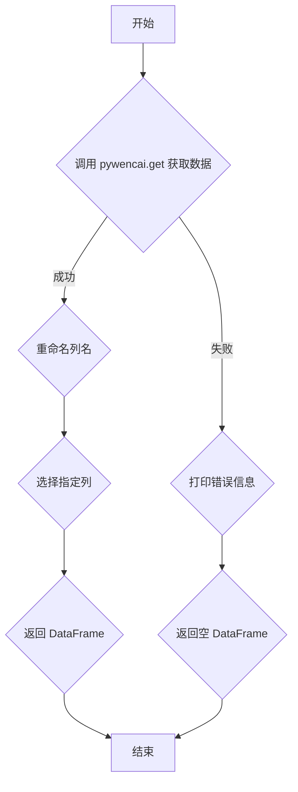

### 用途说明

本函数用于通过问财平台获取满足强赎条件的可转债数据，并返回包含指定列的 Pandas DataFrame。

### 参数

* query (str): 问财搜索语句，用于筛选满足强赎条件的可转债。
### 返回值

* pandas.DataFrame: 包含以下列的可转债数据：
如果获取数据出错，则返回一个空的 DataFrame。

### 用法

```python
import pywencai
import pandas as pd
import numpy as np
import yuhanbolh as lh

# 定义问财搜索语句
query = "满足强赎"

# 调用函数获取数据
data = lh.get_satisfy_redemption(query)

# 打印数据
print(data)
```

### 示例

```python
>>> data = get_satisfy_redemption("满足强赎")
>>> print(data)
     可转债代码 可转债简称     最新价  正股代码 正股简称 强赎天计数
0  113026.SH   华钰转债  120.000  601020.SH  华钰矿业     10
1  110068.SH  华峰转债  115.000  002064.SZ  华峰化学     15
...

```

### 流程图



