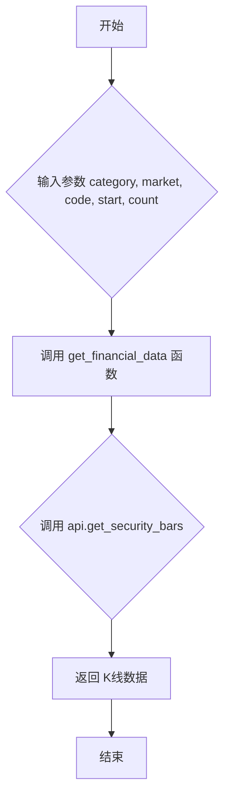

## 用途说明

该函数用于从通达信服务器获取指定股票的K线数据。

## 参数

* category (int): K线类型。
* market (int): 市场代码。
* code (str): 股票代码。
* start (int): 起始位置。0为最新数据，1为次新数据，以此类推。
* count (int): 获取K线数量，最大值为800。
## 返回值

返回一个包含K线数据的列表，由 get_financial_data 函数处理后返回。具体数据格式取决于通达信API的返回格式。如果发生错误，则返回错误信息。

## 用法

调用 get_security_bars(category, market, code, start, count) 获取K线数据。建议根据实际需求设置参数。

## 示例

```python
import yuhanbolh as lh
# 获取通达信的ip地址和端口号，从自己安装的通达信配置文件中读取
lh.init_global_address(r"D:\jiaoyi\gxtdx\connect.cfg")

# 获取平安银行(000001)最近200条日K线数据
k_line_data = lh.get_security_bars(4, 0, '000001', 0, 200)
print(k_line_data)

# 获取贵州茅台(600519)最近50条5分钟K线数据
k_line_data_5min = lh.get_security_bars(0, 1, '600519', 0, 50)
print(k_line_data_5min)
```

## 流程图



## 原代码

```python
def get_security_bars(category, market, code, start, count):
    """获取K线数据
    Args:
        category: K线类型（0 5分钟K线; 1 15分钟K线; 2 30分钟K线; 3 1小时K线; 4 日K线; 5 周K线; 6 月K线; 7 1分钟; 8 1分钟K线; 9 日K线; 10 季K线; 11 年K线）
        market: 市场代码（0:深圳, 1:上海）
        code: 股票代码
        start: 起始位置（0为最新）
        count: 数量，最高800
    """
    return get_financial_data(global_tdx_ip, global_tdx_port, lambda api: api.get_security_bars(category, market, code, start, count))

```

