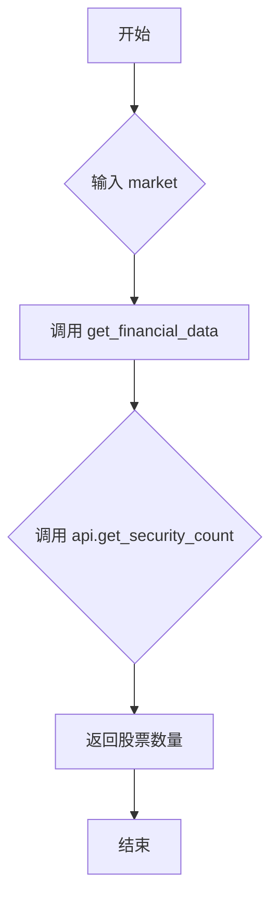

## 用途说明

获取指定市场（深圳或上海）的股票数量。该函数依赖于 get_financial_data 函数以及外部库（例如 TDX API），用于连接金融数据接口并获取数据。

## 参数

* market (int): 市场代码。0 表示深圳市场，1 表示上海市场。
## 返回值

* int: 指定市场的股票数量。如果获取失败，返回值的类型取决于 get_financial_data 的实现，可能返回 None 或其他错误指示值。
## 用法

调用 get_security_count(market)，传入市场代码即可获取对应市场的股票数量。 需要确保已正确配置 global_tdx_ip 和 global_tdx_port  变量，以及安装和配置了必要的库。

## 示例

```python
import yuhanbolh as lh

# 获取通达信的ip地址和端口号，从自己安装的通达信配置文件中读取
lh.init_global_address(r"D:\jiaoyi\gxtdx\connect.cfg")

shenzhen_count = lh.get_security_count(0)
shanghai_count = lh.get_security_count(1)

if shenzhen_count is not None:
    print(f"深圳市场股票数量：{shenzhen_count}")
else:
    print("获取深圳市场股票数量失败")

if shanghai_count is not None:
    print(f"上海市场股票数量：{shanghai_count}")
else:
    print("获取上海市场股票数量失败")
```

## 流程图



## 原代码

```python
def get_security_count(market):
    """获取市场股票数量
    Args:
        market: 市场代码（0:深圳, 1:上海）
    """
    return get_financial_data(global_tdx_ip, global_tdx_port, lambda api: api.get_security_count(market))

```

