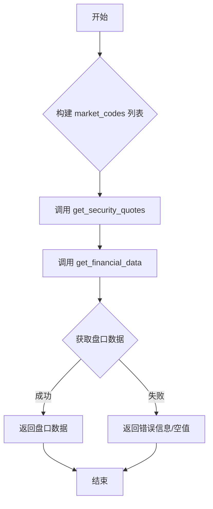

## 用途说明

该函数用于获取指定股票的实时盘口数据（买卖五档）。它通过调用 get_financial_data 函数，并使用 get_security_quotes API 接口从通达信服务器获取数据。

## 参数

* market_codes (list):  股票市场代码和股票代码列表。列表中的每个元素是一个元组，格式为 (市场代码, 股票代码)。
## 返回值

该函数返回 get_financial_data 函数的执行结果，该结果的具体结构取决于 api.get_security_quotes 接口的返回数据格式。通常情况下，会返回一个列表，列表的每个元素对应一个股票的盘口数据，包含买卖五档的价格和数量等信息。如果获取数据失败，可能会返回错误信息或空值。

## 用法

通过传入 market_codes 列表，调用 get_security_quotes 函数获取盘口数据。

## 示例

```python
import yuhanbolh as lh

# 获取通达信的ip地址和端口号，从自己安装的通达信配置文件中读取
lh.init_global_address(r"D:\jiaoyi\gxtdx\connect.cfg")

market_codes = [(0,'000001')]
quotes = lh.get_security_quotes(market_codes)
print(quotes)
```

## 流程图



## 代码

```python
def get_security_quotes(market_codes):
    """获取盘口数据(买卖五档)
    Args:
        market_codes: 列表，每个元素为元组(市场代码,股票代码)，如[(0,'000001'),(0,'000002')]
    """
    return get_financial_data(global_tdx_ip, global_tdx_port, lambda api: api.get_security_quotes(market_codes))
    
```

