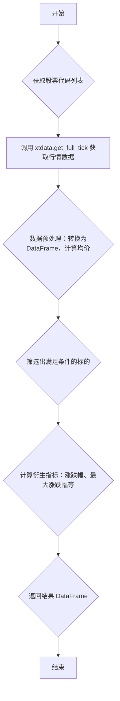

## 用途说明

该函数用于从QMT获取指定股票代码列表的实时行情数据，并筛选出符合条件的标的，计算相关指标，最终返回一个包含所需信息的DataFrame。

## 参数

* code_list (List[str]):  股票代码列表，例如：['000001.SZ', '600000.SH']。
## 返回值

* df (pandas.DataFrame): 包含筛选后的股票行情数据的DataFrame，列名如下：
## 用法

调用 get_snapshot(code_list) 函数，传入股票代码列表，即可获取筛选后的股票行情数据。

## 示例

```python
import yuhanbolh as lh
# 获取股票代码列表
code_list = ['000001.SZ', '600000.SH']

# 调用 get_snapshot 函数获取行情数据
df = lh.get_snapshot(code_list)

# 打印结果
print(df)
```

## 函数工作流程图



```python
# 从QMT获得行情数据，筛选出符合条件的标的数据
def get_snapshot(code_list: List[str]):
    # 获取标的快照数据
    df = xtdata.get_full_tick(code_list)
    df = DataFrame.from_dict(df).T.reset_index().rename(columns={'index': '证券代码'})

    # 计算标的均价
    bidPrice_columns = ['bid1', 'bid2', 'bid3', 'bid4', 'bid5']
    askPrice_columns = ['ask1', 'ask2', 'ask3', 'ask4', 'ask5']
    df[bidPrice_columns] = df['bidPrice'].apply(Series, index=bidPrice_columns)
    df[askPrice_columns] = df['askPrice'].apply(Series, index=askPrice_columns)

    # 对可能需要转换为float的列进行转换
    float_columns = ['bid1', 'bid2', 'bid3', 'bid4', 'bid5', 'ask1', 'ask2', 'ask3', 'ask4', 'ask5', 'amount', 'lastClose', 'volume']
    for col in float_columns:
        df[col] = pd.to_numeric(df[col], errors='coerce')

    df['averagePrice'] = (df['bid1'] + df['ask1']) / 2              # 求买1和卖1的平均价
    df.loc[(df['bid1'] == 0) | (df['ask1'] == 0), 'averagePrice'] = df['bid1'] + df['ask1'] # 涨跌停修正

    df.rename(columns={'averagePrice': 'close', 'lastClose': 'pre_close', 'volume': 'vol'}, inplace=True)
    df['amount'] = df['amount'] / 1e4
    df = df[(df.close != 0) & (df.high != 0)] # 现价大于1的标的

    # 计算衍生指标
    df['pct_chg'] = ((df.close / df.pre_close - 1) * 100)   # 今日涨跌幅（%）
    df['max_pct_chg'] = ((df.high / df.pre_close - 1) * 100)    # 最大涨跌幅（%）

    # 展示列,分别表示：代码、买1和卖1平均价、今日涨跌幅（%）、最大涨跌幅（%）、最高价、最低价、昨收价、成交量、成交额（万元）
    display_columns = ['证券代码', 'close', 'pct_chg', 'max_pct_chg', 'high', 'low', 'pre_close', 'vol', 'amount']
    df = df[display_columns]
    return df
```

