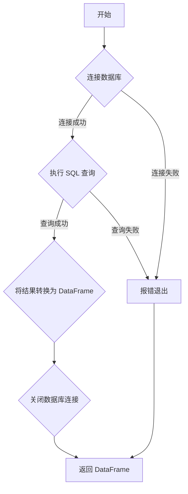

### 用途说明

读取指定 SQLite 数据库文件中的指定表，并将表数据以 Pandas DataFrame 格式返回。

### 参数

* database_path (str): SQLite 数据库文件的路径。
* table_name (str): 要读取的表的名称。
### 用法

调用 get_table(database_path, table_name) 获取指定数据库表的数据。

### 示例

```python
import sqlite3
import pandas as pd

df = get_table('example.db', 'users')
print(df)
```

### 流程图



## 代码

```python
# 读取指定数据库中的指定表，并返回表的内容
def get_table(database_path, table_name):
    """
    读取指定数据库中的指定表，并返回表的内容
    """

    try:
        # 连接到数据库
        conn = sqlite3.connect(database_path)

        # 执行SELECT查询，获取表中的所有行
        query = f'SELECT * FROM "{table_name}"'
        df = pd.read_sql_query(query, conn)

        return df

    except sqlite3.Error as e:
        print("数据库操作错误:", e)

    finally:
        # 关闭连接
        conn.close()
```

