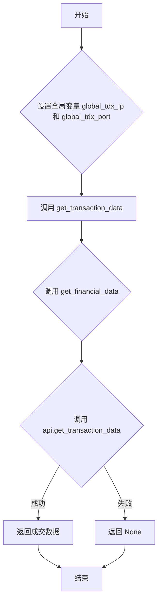

## 用途说明

该函数用于获取指定股票的历史分笔成交数据。数据来源于通达信行情接口。

## 参数

* market (int): 市场代码。0 代表深圳市场，1 代表上海市场。
* code (str): 股票代码。例如："000001"。
* start (int): 起始位置。0 表示最新的成交数据，1 表示次新的，以此类推。
* count (int): 获取的数据数量。
## 返回值

返回一个包含分笔成交数据的列表（具体数据结构由通达信接口决定），或者在发生错误时返回 None。

## 用法

调用 get_transaction_data(market, code, start, count)  以获取历史分笔成交数据。需要预先设置全局变量 global_tdx_ip 和 global_tdx_port 为通达信行情服务器的 IP 地址和端口号。

## 示例

```python
import yuhanbolh as lh

# 获取通达信的ip地址和端口号，从自己安装的通达信配置文件中读取
lh.init_global_address(r"D:\jiaoyi\gxtdx\connect.cfg")

transaction_data = lh.get_transaction_data(0, "000001", 0, 10) 
print(transaction_data)
```

## 流程图



## 代码

```python
def get_transaction_data(market, code, start, count):
    """获取历史分笔成交
    Args:
        market: 市场代码（0:深圳, 1:上海）
        code: 股票代码
        start: 起始位置（0为最新）
        count: 数量
    """
    return get_financial_data(global_tdx_ip, global_tdx_port, lambda api: api.get_transaction_data(market, code, start, count))

```

