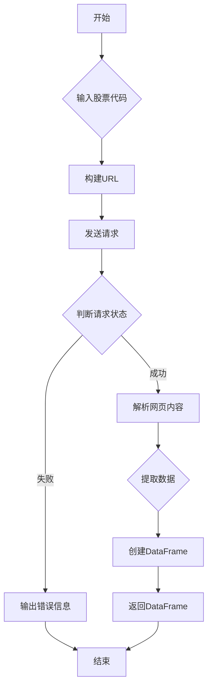

## 用途说明

该函数用于获取指定股票代码在价值大师网站上的估值数据，包括大师价值、价值现价、评价、价值估值和基本数据等信息。

## 参数

* code (str): 股票代码，例如 '600519' 或 'HK00700'。
## 返回值

* pandas.DataFrame: 包含以下列的DataFrame：
## 用法

调用 get_valuation_ratios(code) 函数，传入股票代码作为参数，即可获取该股票的估值数据。

## 示例

```python
import pandas as pd
import yuhanbolh as lh

# 获取股票代码为 '600519' 的估值数据
valuation_data = lh.get_valuation_ratios('600519')

# 打印估值数据
print(valuation_data)
```

## 函数工作流程图



## 代码

```python
import requests
from bs4 import BeautifulSoup
import re
import pandas as pd
import random
import time

# 通过代码，获取价值大师的价值线
def get_valuation_ratios(code):
    try:
        url = 'https://www.gurufocus.cn/stock/{}/term/gf_value'.format(code)

        # 设置随机的User-Agent
        user_agents = [
            'Mozilla/5.0 (Windows NT 10.0; Win64; x64) AppleWebKit/537.36 (KHTML, like Gecko) Chrome/91.0.4472.124 Safari/537.36',
            'Mozilla/5.0 (Macintosh; Intel Mac OS X 10_15_7) AppleWebKit/537.36 (KHTML, like Gecko) Chrome/91.0.4472.124 Safari/537.36',
            'Mozilla/5.0 (Windows NT 10.0; Win64; x64; rv:89.0) Gecko/20100101 Firefox/89.0',
        ]
        headers = {
            'User-Agent': random.choice(user_agents),
            'Accept': 'text/html,application/xhtml+xml,application/xml;q=0.9,image/webp,image/apng,*/*;q=0.8',
            'Accept-Language': 'en-US,en;q=0.9',
            'Referer': 'https://www.google.com/',
            'DNT': '1',
            'Connection': 'keep-alive',
            'Upgrade-Insecure-Requests': '1',
            'Cache-Control': 'max-age=0',
            'Sec-Fetch-Site': 'none',
            'Sec-Fetch-Mode': 'navigate',
            'Sec-Fetch-User': '?1',
            'Sec-Fetch-Dest': 'document'
        }


        # 添加随机延迟
        time.sleep(random.uniform(1, 5))

        response = requests.get(url, headers=headers)

        if response.status_code == 200:
            # 使用BeautifulSoup解析网页内容
            soup = BeautifulSoup(response.content, 'html.parser')
            
            # 获取文本内容
            text = soup.get_text()
            # print(text)
            
            # 去掉换行符，保留空格
            text = re.sub(r'\n+', ' ', text)
            # print(text)

            # 尝试使用下面的代码提取数据
            element_mc = None
            element_xj = None
            element_data = None
            element_pj = None
            element_jzxs = None

            # 定义匹配模式，查找“大师价值 为”后面的数值
            # 根据code的前两位决定匹配模式
            if code[:2] == 'HK':
                pattern_master_value = re.compile(r'大师价值 : HK\$ [\d\.]+ \(今日\)[\s\S]*?HK\$ (\d+\.\d+)')
            else:
                pattern_master_value = re.compile(r'大师价值 : [¥$] ([\d\.]+)')
                
            element_jzxs = pattern_master_value.findall(text)   # 大师价值
            if element_jzxs:
                element_jzxs = element_jzxs[0]

            # 正则表达式匹配从"登录/注册价值大师/股票列表/"开始，到"价值大师评分"结束的文本
            pattern = re.compile(r'登录/注册价值大师/股票列表/.*?价值大师评分')
            match = pattern.search(text)

            if match:
                extracted_text = match.group(0)
                # print(extracted_text)
                
                name_pattern = re.compile(r'/([\u4e00-\u9fa5]+)\(')  # 匹配形如 /平安银行( 或 /苹果( 的名称
                name_match = name_pattern.search(extracted_text)
                element_mc = name_match.group(1) if name_match else None
                
                price_pattern = re.compile(r'[¥$]([\d\.]+)')
                price_match = price_pattern.search(extracted_text)
                element_xj = price_match.group(1) if price_match else None
                
                # 提取 element_xj 后面的第三个空格到第四个空格的内容
                data_pattern = re.compile(r'[¥$]{}\s+(.*?)\s+(.*?)\s+(.*?)\s+(.*?)\s+'.format(element_xj))
                data_match = data_pattern.search(extracted_text)
                if data_match:
                    element_data = data_match.group(3)
                    # print(element_data)
                else:
                    element_data = None

                # 提取 element_xj 的第六个到第七个空格的内容
                pj_pattern = re.compile(r'[¥$]{}\s+(.*?)\s+(.*?)\s+(.*?)\s+(.*?)\s+(.*?)\s+(.*?)\s+'.format(element_xj))
                pj_match = pj_pattern.search(extracted_text)
                if pj_match:
                    element_pj = pj_match.group(6)
                    # print(element_pj)
                else:
                    element_pj = None

            # 如果下面的代码没有提取到数据，则使用上面的代码进行提取
            if not all([element_mc, element_xj, element_data, element_pj]):
                # 定义匹配模式，查找“当前股价 为”后面的数值
                pattern_current_price = re.compile(r'当前股价 为 [¥$]([\d\.]+)')

                # 定义匹配模式，查找“的评级是：”后面的文字，直到遇到下一个空格或标点符号
                pattern_rating = re.compile(r'评级是： ([^ ，。]+)')

                # 查找所有匹配的数值
                element_xj = pattern_current_price.findall(text)   # 价值现价
                element_pj = pattern_rating.findall(text)   # 评价

                # 如果提取到数据，则更新变量
                if element_xj:
                    element_xj = element_xj[0]
                if element_pj:
                    element_pj = element_pj[0]

            # 计算价值估值
            try:
                if element_pj == "股价被严重高估":
                    Fraction_pj = -2
                elif element_pj == "股价被高估":
                    Fraction_pj = -1
                elif element_pj == "股价被低估":
                    Fraction_pj = 1
                elif element_pj == "股价被严重低估":
                    Fraction_pj = 2
                else:
                    Fraction_pj = 0
            except:
                Fraction_pj = 0

            # 创建DataFrame
            ratios = pd.DataFrame({
                '价值代码': [code],
                '价值名称': [element_mc],
                '价值现价': [element_xj],
                '大师价值': [element_jzxs],
                '评价': [element_pj],
                '价值估值': [Fraction_pj],
                '基本数据': [element_data],
            })

            print(ratios)
            return ratios
        else:
            print('请求失败:', response.status_code)
    except Exception as e:
        print(f'发生错误: {e}')
```

