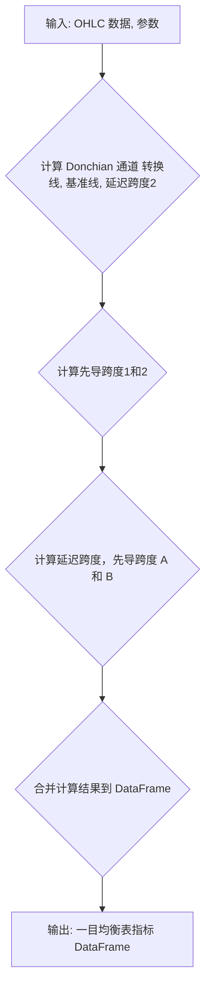

### 用途说明

ichimoku_cloud 函数用于计算金融时间序列数据的一目均衡表指标，并返回包含计算结果的 Pandas DataFrame。

### 参数

* data (pandas.DataFrame): 包含 'high', 'low', 'close' 列的 OHLC 金融时间序列数据。
* conversion_periods (int): 计算转换线的周期数，默认为 9。
* base_periods (int): 计算基准线的周期数，默认为 26。
* lagging_span2_periods (int): 计算延迟跨度2的周期数，默认为 52。
* displacement (int):  指标的位移量，默认为 26。
### 用法

调用 ichimoku_cloud(data, conversion_periods, base_periods, lagging_span2_periods, displacement) 函数，传入 OHLC 数据和参数，即可获得包含以下列的 DataFrame：

* 'Conversion Line': 转换线
* 'Base Line': 基准线
* 'Lagging Span': 延迟跨度
* 'lead_line1':  先导跨度1的一部分
* 'lead_line2':  先导跨度2的一部分
* 'Leading Span A': 先导跨度 A
* 'Leading Span B': 先导跨度 B
### 示例

```python
import pandas as pd
import yuhanbolh as lh

# 示例数据
data = pd.DataFrame({
    'high': [10, 12, 15, 14, 16, 13, 18, 20, 19, 22],
    'low': [8, 9, 12, 11, 13, 10, 15, 17, 16, 19],
    'close': [9, 11, 14, 13, 15, 12, 17, 19, 18, 21]
})

# 计算一目均衡表指标
ichimoku_data = ichimoku_cloud(data, 9, 26, 52, 26)

# 打印结果
print(ichimoku_data)
```

### 函数工作流程图



## 代码

```python
# 获取一目均衡表基准线 (data, conversion_periods, base_periods, lagging_span2_periods, displacement)
# 参数有5个，第一个是数据源，其他4个分别是一目均衡表基准线 (9, 26, 52, 26)，即ichimoku_cloud(data,9, 26, 52, 26)
def ichimoku_cloud(data, conversion_periods, base_periods, lagging_span2_periods, displacement):
    def donchian(length):
        return (data['high'].rolling(length).max() + data['low'].rolling(length).min()) / 2
    
    conversion_line = donchian(conversion_periods)
    base_line = donchian(base_periods)
    lead_line1 = (conversion_line + base_line) / 2
    lead_line2 = donchian(lagging_span2_periods)
    
    lagging_span = data['close'].shift(-displacement + 1).shift(25).ffill()
    leading_span_a = lead_line1.shift(displacement - 1)
    leading_span_b = lead_line2.shift(displacement - 1)
    
    ichimoku_data = pd.concat([conversion_line, base_line, lagging_span, lead_line1, lead_line2, leading_span_a, leading_span_b], axis=1)
    ichimoku_data.columns = ['Conversion Line', 'Base Line', 'Lagging Span', 'lead_line1', 'lead_line2', 'Leading Span A', 'Leading Span B']
    
    return ichimoku_data.dropna()
```

