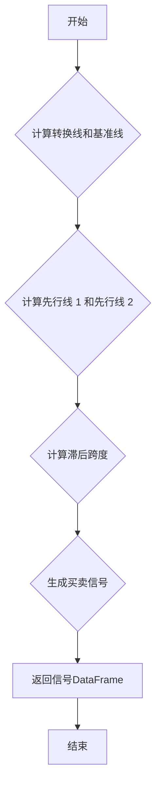

## 用途说明

计算一目均衡表的基准线，并生成买卖信号。

## 参数

* data (DataFrame): 包含股票或金融资产历史数据的 DataFrame，必须包含 'high'、'low' 和 'close' 列。
* conversion_periods (int): 转换线周期，通常设置为 9。
* base_periods (int): 基准线周期，通常设置为 26。
* lagging_span2_periods (int): 滞后跨度 2 周期，通常设置为 52。
* displacement (int): 位移量，通常设置为 26。
## 返回值

* DataFrame: 包含交易信号的 DataFrame，列名为 'Ichimoku'。买入信号为 1，卖出信号为 -1，中性信号为 0。
## 用法

### 示例代码

```python
import pandas as pd
import numpy as np

# 示例数据
data = pd.DataFrame({
    'high': np.random.rand(100),
    'low': np.random.rand(100),
    'close': np.random.rand(100)
})

# 调用 ichimoku_cloud_zb 函数
signal_df = ichimoku_cloud_zb(data, 9, 26, 52, 26)

# 打印信号
print(signal_df.head())
```

## 函数工作流程图



## 函数代码

```python
def ichimoku_cloud_zb(data, conversion_periods, base_periods, lagging_span2_periods, displacement):
    def donchian(length):
        return (data['high'].rolling(length).max() + data['low'].rolling(length).min()) / 2
    
    conversion_line = donchian(conversion_periods)
    base_line = donchian(base_periods)
    lead_line1 = (conversion_line + base_line) / 2
    lead_line2 = donchian(lagging_span2_periods)
    
    lagging_span = data['close'].shift(-displacement + 1).shift(25).ffill()
    leading_span_a = lead_line1.shift(displacement - 1)
    leading_span_b = lead_line2.shift(displacement - 1)
    # 计算买入和卖出信号
    buy_signal = (base_line < data['close']) & (conversion_line > data['close'].shift(1)) & (conversion_line <= data['close']) & (lead_line1 > data['close']) & (lead_line1 > lead_line2)
    sell_signal = (base_line > data['close']) & (conversion_line < data['close'].shift(1)) & (conversion_line >= data['close']) & (lead_line1 < data['close']) & (lead_line1 < lead_line2)
    # 使用np.where生成信号列，买入为1，卖出为-1，中立为0
    signal = np.where(buy_signal, 1, np.where(sell_signal, -1, 0))
    
    return pd.DataFrame(signal, columns=['Ichimoku'])
```

