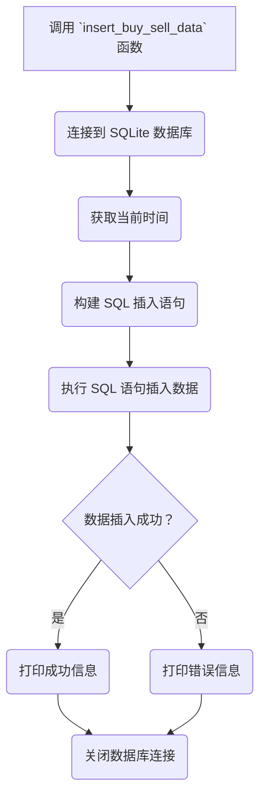

## 用途说明

该函数用于将证券交易数据（包括证券代码、委托价格、委托数量、买卖方向、策略名称和委托备注）插入到指定的 SQLite 数据库表中。

## 参数

* place_order_table (str): 要插入数据的数据库表名。
* security_code (str): 证券代码。
* order_price (float): 委托价格。
* order_volume (int): 委托数量。
* trade_direction (int): 买卖方向，1 表示买入，-1 表示卖出。
* strategy_name (str): 策略名称。
* order_remark (str): 委托备注。
## 用法

函数调用示例：

```python
import yuhanbolh as lh

lh.insert_buy_sell_data('order_table', '000001.SZ', 10.00, 1000, -1, '策略A', '卖出信号')
```

该示例将向名为 'order_table' 的数据库表中插入一条卖出 '000001.SZ' 证券的记录，委托价格为 10.00，委托数量为 1000 股，策略名称为 '策略A'，委托备注为 '卖出信号'。

## 流程图



## 代码

```python
import sqlite3
import datetime

# 数据库路径
db_path = 'trading_data.db'

# 当为卖出时插入的数据，参数包括数据表名、证券代码、委托价格、委托数量、买卖方向、策略名称、委托备注
def insert_buy_sell_data(place_order_table, security_code, order_price, order_volume, trade_direction, strategy_name, order_remark):
    try:
        # 连接到 SQLite 数据库
        conn = sqlite3.connect(db_path)

        # 获取当前时间，精确到分钟
        current_time = datetime.datetime.now().strftime('%Y-%m-%d %H:%M')

        insert_query = f"""
        INSERT INTO {place_order_table} (证券代码, 委托价格, 委托数量, 买卖, 策略名称, 委托备注, 日期时间)
        VALUES (?, ?, ?, ?, ?, ?, ?)
        """
        values = (
            security_code,
            order_price,
            order_volume,
            trade_direction,  # 1 表示买入，-1 表示卖出
            strategy_name,
            order_remark,
            current_time,
        )
        conn.execute(insert_query, values)
        conn.commit()
        print(f"数据插入成功: {values}")
    except Exception as e:
        print(f"插入数据时出错: {e}")
    finally:
        # 无论是否出现异常，都关闭数据库连接
        conn.close()
```

