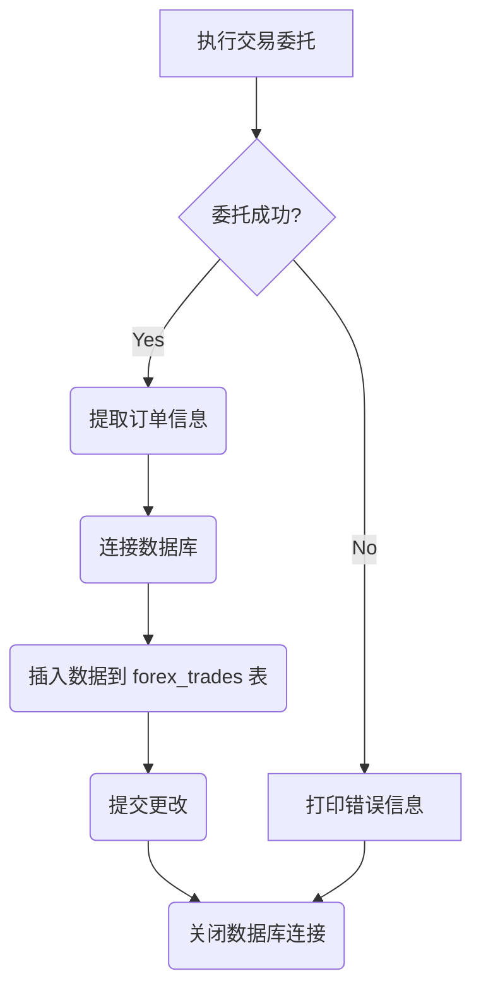

### 用途说明

该函数用于将交易委托后的数据插入到指定的 SQLite 数据库中，用于记录成交历史数据。

### 参数

* db_path (str): 数据库文件的路径。
* result (OrderSendResult): 交易委托返回的结果对象，包含订单信息和执行状态。
### 用法

在成功执行交易委托后，调用 insert_into_db(db_path, result) 将订单信息插入到数据库。

### 示例

```python
import sqlite3
from MetaTrader5 import *
import yuhanbolh as lh

# 初始化 MT5 连接
MT5Initialize()

# ... 执行交易委托，获取结果对象 result

# 将数据插入数据库
lh.insert_into_db("forex_trades.db", result)
```

### 流程图



## 代码

```python
# 将委托后数据插入到成交历史数据到数据库
def insert_into_db(db_path, result):
    try:
        # 检查是否成功执行订单
        if result.retcode != 10009:
            print("Order not executed successfully, retcode:", result.retcode)
            return
        # 连接到数据库
        conn = sqlite3.connect(db_path)
        cursor = conn.cursor()

        # 提取交易请求的信息，并使用返回的订单号更新
        request = result._asdict()['request']._asdict()
        request['order'] = result.order  # 使用返回的订单号更新请求字典

        # 将信息插入到forex_trades表中
        cursor.execute("INSERT INTO forex_trades (交易类型, EA_id, 订单号, 品种名称, 交易量, 价格, Limit挂单, 止损, 止盈, 价格偏差, 订单类型, 成交类型, 订单有效期, 订单到期, 订单注释, 持仓单号, 反向持仓单号) VALUES (?, ?, ?, ?, ?, ?, ?, ?, ?, ?, ?, ?, ?, ?, ?, ?, ?)",
                       (request['action'], request['magic'], request['order'], request['symbol'], request['volume'], request['price'], request['stoplimit'], request['sl'], request['tp'], request['deviation'], request['type'], request['type_filling'], request['type_time'], request['expiration'], request['comment'], request['position'], request['position_by']))

        # 提交更改
        conn.commit()

    except Exception as e:
        print("发生错误:", e)

    finally:
        # 关闭数据库连接
        if conn:
            conn.close()
```

