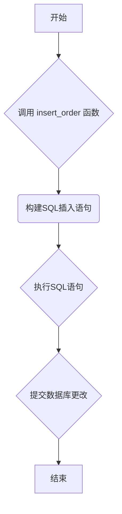

## 用途说明

该函数用于将新的订单信息插入到数据库的 place_general_order 表中。

## 参数

* cursor (database cursor): 数据库游标对象，用于执行SQL语句。
* conn (database connection): 数据库连接对象，用于提交数据库操作。
* code (str): 证券代码。
* price (float): 委托价格。
* quantity (int): 委托数量。
* buy_sell (str): 买卖方向，'buy'表示买入，'sell'表示卖出。
* strategy (str): 策略名称。
* remark (str): 委托备注。
* datetime_str (str): 委托下单时间，格式为 'YYYY-MM-DD HH:mm:ss'。
## 用法

调用 insert_order() 函数，并将订单的各项信息作为参数传入即可。

## 示例

```python
# 建立数据库连接 (示例代码，实际使用时请替换为您的数据库连接信息)
import sqlite3
import yuhanbolh as lh

conn = sqlite3.connect('mydatabase.db')
cursor = conn.cursor()

# 插入订单
insert_order(cursor, conn, '000001', 10.00, 1000, 'buy', 'strategy1', 'test order', '2023-12-20 10:00:00')

# 关闭数据库连接
conn.close()
```

## 流程图



```python
def insert_order(cursor, conn, code, price, quantity, buy_sell, strategy, remark, datetime_str):
    """
    插入订单到place_general_order表
    """
    cursor.execute("""
        INSERT INTO place_general_order (证券代码, 委托价格, 委托数量, 买卖, 策略名称, 委托备注, 日期时间)
        VALUES (?, ?, ?, ?, ?, ?, ?)
    """, (code, price, quantity, buy_sell, strategy, remark, datetime_str))
    conn.commit()
```

