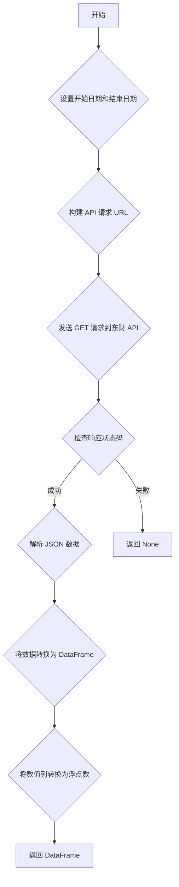

### 用途说明

该函数用于从东方财富 API 获取指定股票代码和时间范围内的历史股票数据，并将数据转换为 Pandas DataFrame 格式，方便进行数据分析和处理。

### 参数解释

* code (str): 6 位数的股票代码，例如 '600030'。
* year (int, optional): 获取过去多少年的数据，默认为 7 年。
* fqt (int, optional): 复权方式，默认为 1 (前复权)，0 为不复权。
### 返回值

* df (pandas.DataFrame): 包含历史股票数据的 DataFrame，如果发生错误则返回 None。 DataFrame 的列名如下：
### 用法

调用 json_to_dfcf(code, year, fqt) 函数，传入股票代码、时间范围和复权方式，即可获取历史股票数据。

### 示例

```python
import pandas as pd
import datetime
import requests
import yuhanbolh as lh

df = lh.getjson_to_dfcf('600030', year=5, fqt=1)

# 打印 DataFrame 的前 5 行
print(df.head())
```

### 函数工作流程图



## 代码

```python
# 通过代码获取最新数据（东财api）
def json_to_dfcf(code, days=1, fqt=1, klt=101):     # 参数参考我的东方财富api文档
if code.endswith("SH"):
    code = "1." + code[:-3]
else:
    code = "0." + code[:-3]
try:
    today = datetime.now().date()
    start_time = (today - timedelta(days=days)).strftime("%Y%m%d")
    end_date = today.strftime('%Y%m%d')
    url = f'http://push2his.eastmoney.com/api/qt/stock/kline/get?&secid={code}&fields1=f1,f3&fields2=f51,f52,f53,f54,f55,f56,f57,f58,f59,f60,f61&klt={klt}&&fqt={fqt}&beg={start_time}&end={end_date}'
    response = requests.get(url)
    data = response.json()
    data = [x.split(',') for x in data['data']['klines']]
    column_names = ['time', 'open', 'close', 'high', 'low', 'volume', 'amount', 'amplitude', 'percentage change', 'change amount', 'turnover rate']
    df = pd.DataFrame(data, columns=column_names)

    # 转换列为浮点数
    float_columns = ['open', 'close', 'high', 'low', 'volume', 'amount', 'amplitude', 'percentage change', 'change amount', 'turnover rate']
    for col in float_columns:
        df[col] = pd.to_numeric(df[col], errors='coerce')  # 将无法转换的值设为NaN
    
    return df
except Exception as e:
    print(f"发生异常: {e}")
    return None
```

