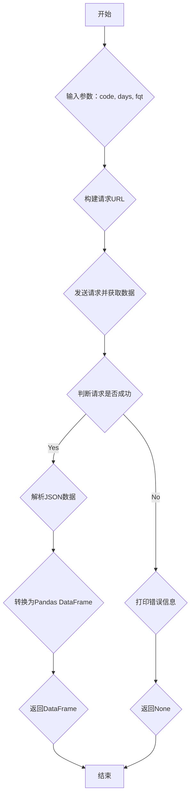

### 用途说明

该函数用于获取指定股票的最新数据，数据源为东方财富网。用户可以通过传入股票代码、查询天数和复权类型来自定义数据获取。

### 参数

* code (str): 股票代码，格式为 "000001.SZ" 或 "600000.SH"，必填。
* days (int): 查询天数，默认为 7*365，即查询最近7年的数据。
* fqt (int): 复权类型，默认为 1，具体含义如下：
### 用法

函数调用示例及返回值说明：

* 调用 json_to_dfcf_qmt(code, days, fqt) 获取数据，返回值为 Pandas DataFrame 格式。
### 示例

```python
import pandas as pd
from datetime import datetime, timedelta
import requests
import yuhanbolh as lh

df = lh.json_to_dfcf_qmt('000001.SZ', days=365, fqt=1)
print(df.head())

```

### 流程图



### 代码

```python
# 通过类似000001.SZ的代码获取最新数据（东财api），参数3个，分别是：代码（必要），天数，复权类型
def json_to_dfcf_qmt(code, days=7*365, fqt=1):
    if code.endswith("SH"):
        code = "1." + code[:-3]
    else:
        code = "0." + code[:-3]
    try:
        today = datetime.now().date()
        start_time = (today - timedelta(days=days)).strftime("%Y%m%d")
        end_date = today.strftime('%Y%m%d')
        url = f'http://push2his.eastmoney.com/api/qt/stock/kline/get?&secid={code}&fields1=f1,f3&fields2=f51,f52,f53,f54,f55,f56,f57,f58,f59,f60,f61&klt=101&fqt={fqt}&beg={start_time}&end={end_date}'
        response = requests.get(url)
        data = response.json()
        data = [x.split(',') for x in data['data']['klines']]
        column_names = ['time', 'open', 'close', 'high', 'low', 'volume', 'amount', 'amplitude', 'percentage change', 'change amount', 'turnover rate']
        df = pd.DataFrame(data, columns=column_names)

        # 转换列为浮点数
        float_columns = ['open', 'close', 'high', 'low', 'volume', 'amount', 'amplitude', 'percentage change', 'change amount', 'turnover rate']
        for col in float_columns:
            df[col] = pd.to_numeric(df[col], errors='coerce')  # 将无法转换的值设为NaN
        
        return df
    except Exception as e:
        print(f"发生异常: {e}")
        return None
```

