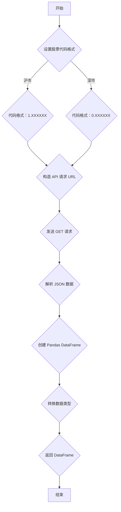

## 用途说明

该函数用于从东方财富网获取指定股票的交易数据，与json_to_dfcf_qmt 函数相同，只是将日期改为交易日期，并将其转换为 Pandas DataFrame 格式。

## 参数

* code (str): 股票代码，格式为 'XXXXXX.SS' 或 'XXXXXX.SZ'，例如 '600519.SS'。
* days (int, optional): 获取的交易日天数。默认为 7*250，即大约一年的交易日数据。
* fqt (int, optional): 复权方式，默认为 1。
## 用法

函数调用示例及返回值说明：

* 调用 json_to_dfcf_qmt_jyr(code, days, fqt) 获取股票交易数据。
* 返回值是一个 Pandas DataFrame，包含以下列：
## 示例

```python
import pandas as pd
from datetime import datetime
import requests
import yuhanbolh as lh

df = lh.json_to_dfcf_qmt_jyr('600519.SS', days=100, fqt=1)
print(df.head())
```

## 函数工作流程图



## 代码

```python
def json_to_dfcf_qmt_jyr(code, days=7*250, fqt=1):
    """
    从东方财富网获取指定股票的交易数据，并将其转换为 Pandas DataFrame 格式。

    Args:
        code (str): 股票代码，格式为 'XXXXXX.SS' 或 'XXXXXX.SZ'，例如 '600519.SS'。
        days (int, optional): 获取的交易日天数。默认为 7*250，即大约一年的交易日数据。
        fqt (int, optional): 复权方式，默认为 1。
            0: 不复权
            1: 前复权

    Returns:
        pandas.DataFrame: 包含股票交易数据的 DataFrame，如果发生错误则返回 None。
    """

    if code.endswith("SH"):
        code = "1." + code[:-3]
    else:
        code = "0." + code[:-3]
    try:
        today = datetime.now().date()
        end_date = today.strftime('%Y%m%d')
        url = f'http://push2his.eastmoney.com/api/qt/stock/kline/get?&secid={code}&fields1=f1,f3&fields2=f51,f52,f53,f54,f55,f56,f57,f58,f59,f60,f61&klt=101&fqt={fqt}&end={end_date}&lmt={days}'
        response = requests.get(url)
        data = response.json()
        data = [x.split(',') for x in data['data']['klines']]
        column_names = ['time', 'open', 'close', 'high', 'low', 'volume', 'amount', 'amplitude', 'percentage change', 'change amount', 'turnover rate']
        df = pd.DataFrame(data, columns=column_names)

        # 转换列为浮点数
        float_columns = ['open', 'close', 'high', 'low', 'volume', 'amount', 'amplitude', 'percentage change', 'change amount', 'turnover rate']
        for col in float_columns:
            df[col] = pd.to_numeric(df[col], errors='coerce')  # 将无法转换的值设为NaN
        
        return df
    except Exception as e:
        print(f"发生异常: {e}")
        return None
```

