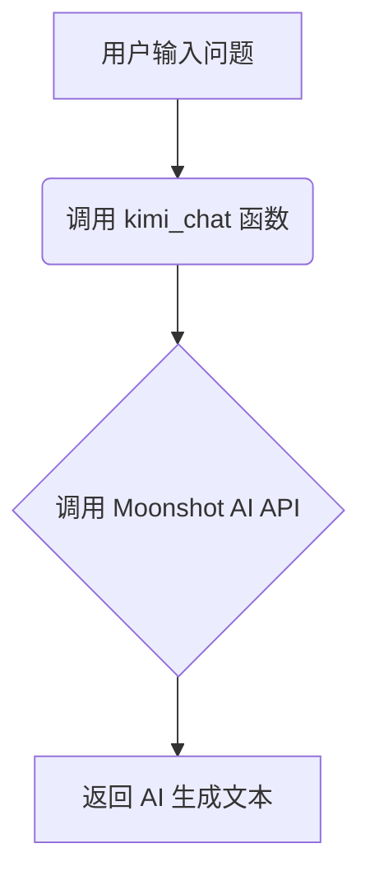

## 用途说明

kimi_chat 函数用于调用 Moonshot AI API 生成文本，用户输入想要询问 AI 的问题，函数返回 AI 生成的文本。

## 参数

* user_message (str): 用户想要询问 AI 的问题。
## 用法

调用 kimi_chat(user_message) 并传入用户问题，即可获得 AI 生成的文本。

## 示例

```python
response = kimi_chat("用 Python 写一个快速排序算法")
print(response)
```

## 流程图



## 代码

```python
def kimi_chat(user_message):
    client = OpenAI(
        api_key=check_account("password", "MOONSHOT_API_KEY"),
        base_url="https://api.moonshot.cn/v1",
    )
    completion = client.chat.completions.create(
        model="moonshot-v1-32k",
        messages=[
          # {"role": "system", "content": "你是 Kimi，由 Moonshot AI 提供的人工智能助手，你更擅长中文和英文的对话。你会为用户提供安全，有帮助，准确的回答。同时，你会拒绝一切涉及恐怖主义，种族歧视，黄色暴力等问题的回答。Moonshot AI 为专有名词，不可翻译成其他语言。"},
          {"role": "user", "content": user_message}
        ],
        temperature=0.3,
    )

    return completion.choices[0].message.content
```

