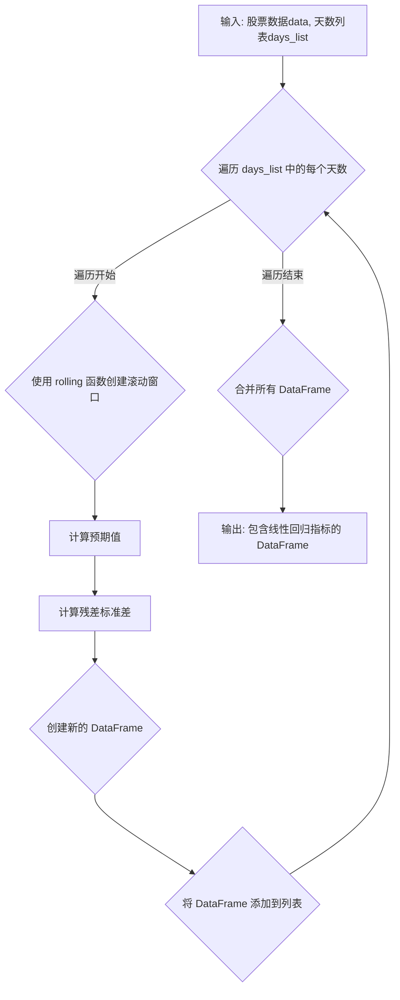

## 用途说明

该函数用于计算股票价格的线性回归指标，包括预期值和残差标准差，用于分析股票价格走势。

## 参数

* data (pd.DataFrame): 股票价格数据，包含 'close' 列，表示收盘价。
* days_list (list): 一个包含天数的列表，用于指定计算线性回归指标的滚动窗口大小。
## 用法

函数调用示例及返回值说明：

```python
import yuhanbolh as lh
result = linear_regression_dfcf(data, days_list)
```

result 是一个 Pandas DataFrame，包含以下列：

* 对于 days_list 中的每个 many_days：
## 示例

```python
import pandas as pd
import numpy as np
from scipy import stats

# 示例股票数据
data = pd.DataFrame({'close': [10, 11, 12, 11, 13, 14, 15, 14, 16, 17]})

# 计算 3 天和 5 天的线性回归指标
days_list = [3, 5]
result = linear_regression_dfcf(data, days_list)

print(result)
```

## 流程图



## 代码

```python
# 计算线性回归
def linear_regression_dfcf(data, days_list):
    df_list = []
    for many_days in days_list:
        # 使用 rolling 函数创建滚动窗口
        expected_values = (
            data['close']
            .rolling(window=many_days)
            .apply(lambda y: stats.linregress(np.arange(len(y)), y)[1] + stats.linregress(np.arange(len(y)), y)[0] * (len(y) - 1), raw=True)
        )
        # 计算滚动窗口的残差标准差
        std_residuals = (
            data['close']
            .rolling(window=many_days)
            .apply(lambda y: np.std(y - (stats.linregress(np.arange(len(y)), y)[1] + stats.linregress(np.arange(len(y)), y)[0] * np.arange(len(y)))), raw=True)
        )

        # 创建新的 DataFrame
        temp_df = pd.DataFrame({
            f"expected_value_{many_days}day": expected_values,
            f"std_residuals_{many_days}day": std_residuals
        })
        df_list.append(temp_df)

    result = pd.concat(df_list, axis=1)

    return result
```

