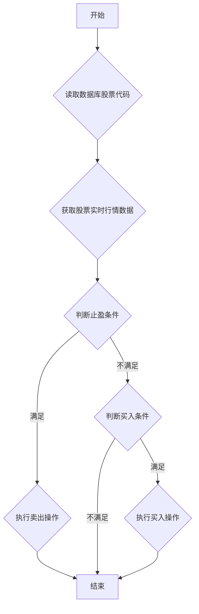

## 用途说明

该函数实现了一种基于预设条件的动态股票交易策略，称为“打地鼠”策略。它读取指定数据库表中的股票代码，获取对应的实时行情数据，根据预设的止盈和买入条件判断是否进行交易操作，并最终通过 xt_trader 执行交易指令。

## 参数

* db_path (str): 数据库文件的路径。
* table_name (str): 读取股票代码的数据表名称。
* acc (str): 账户标识符。
* drawdown (float): 触发止盈的最大回撤跌幅，例如 0.05 表示 5%。
* active_thres (float): 激活止盈的最大涨幅阈值，例如 0.1 表示 10%。只有当股票涨幅超过该阈值后，才会触发后续的止盈判断。
* deal_thres (float): 执行止盈的最小涨幅阈值，例如 0.03 表示 3%。只有当股票涨幅超过该阈值且满足其他止盈条件时，才会执行卖出操作。
## 用法

调用 mole_hunting_delegation(db_path, table_name, acc, drawdown, active_thres, deal_thres)，函数将执行以下操作：

1. 读取数据库中的股票代码列表。
1. 获取每只股票的实时行情数据。
1. 根据预设条件判断是否触发止盈或买入条件。
1. 对于满足止盈条件的股票，执行卖出操作。
1. 对于满足买入条件的股票，执行买入操作。
## 示例

```python
import yuhanbolh as lh

lh.mole_hunting_delegation(db_path='stock_data.db', 
                      table_name='selected_stocks', 
                      acc='your_account_id', 
                      drawdown=0.05, 
                      active_thres=0.1, 
                      deal_thres=0.03)
```

## 函数流程图



